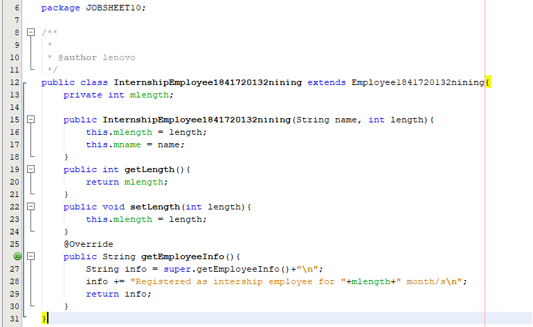
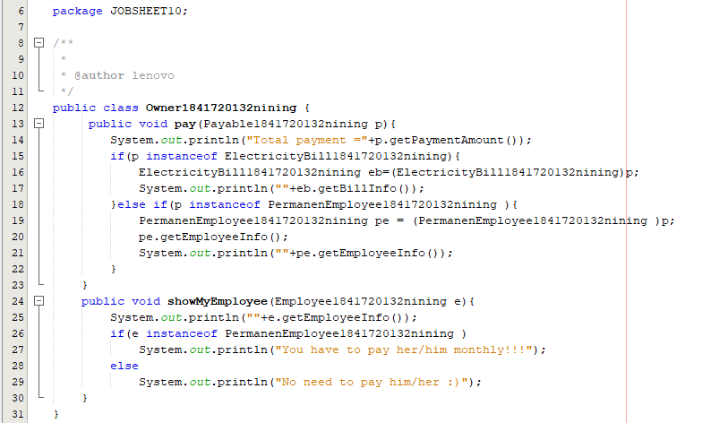

# Laporan Praktikum #10 - Pengantar Konsep PBO

## Kompetensi

Setelah melakukan percobaan pada jobsheet ini, diharapkan mahasiswa mampu: 
a. Memahami konsep dan bentuk dasar polimorfisme 
b. Memahami konsep virtual method invication 
c. Menerapkan polimorfisme pada pembuatan heterogeneous collection 
d. Menerapkan polimorfisme pada parameter/argument method 
e. Menerapkan object casting untuk meng-ubah bentuk objek

## Ringkasan Materi

Polymorphism merupakan salah satu konsep penting dalam object oriented programming (OOP) khususnya di bahasa pemrograman Java setelah abstraction dan inheritance. Polymorphism berarti banyak bentuk. Ada beberapa definisi berbeda tentang polymorphism yang berkaitan dengan pemrograman berorientasi obyek. Sedangkan apa yang dimaksud dengan polymorphism sendiri, sebenarnya sulit untuk didefinisikan. Sejalan dengan contoh yang diberikan, Anda diharapkan dapat mengerti dan memahami konsep polymorphism itu sendiri.

Polymorphism sering dikaitkan dengan penggunaan lebih dari satu metoda dengan nama sama. Penggunaan metoda dengan nama sama dapat diterapkan dengan method overloading dan method overriding. Peran polymorphism sebenarnya tidak terbatas hanya pada hal tersebut. Ada keterkaitan antara polymorphism dan inheritance (turunan).

Dalam konsep turunan, saat obyek dari subclass dikonstruksi, obyek dari superclass juga ikut dikonstruksi. Jadi setiap instance dari subclass adalah juga instance dari superclass. Apabila Anda mendeklarasikan metoda dengan parameter dari tipe superclass, Anda diperbolehkan untuk memberi argumen berupa obyek subclass yang merupakan turunan dari superclass tersebut.

## Praktikum

### Percobaan 1 : Bentuk dasar polimorfisme

1. Screenshot kode program class Employee1841720132nining.

 

2. Screenshot kode program class Interface Payable1841720132nining.

 

3. Screenshot kode program class InternshipEmployee1841720132nining

 

4. Screenshot kode program class PermanentEmployee1841720132nining.

 

5. Screenshot kode program class ElectricityBill1841720132nining.

 

6. Screenshot kode program class Tester11841720132nining beserta outputnya.

 

link kode program : [Employee1841720132nining.java](../../src/10_Polimorfisme/Employee1841720132nining.java)

link kode program : [Payable1841720132nining.java](../../src/10_Polimorfisme/Payable1841720132nining.java)

link kode program : [InternshipEmployee1841720132nining.java](../../src/10_Polimorfisme/InternshipEmployee1841720132nining.java)

link kode program : [PermanentEmployee1841720132nining.java](../../src/10_Polimorfisme/PermanenEmployee1841720132nining.java)

link kode program : [ElectricityBill1841720132nining.java](../../src/10_Polimorfisme/ElectricityBill1841720132nining.java)

link kode program : [Tester11841720132nining.java](../../src/10_Polimorfisme/Tester11841720132nining.java)

## Pertanyaan

1. Class apa sajakah yang merupakan turunan dari class Employee? 

Jawab : Internship Employee dan PermanentEmployee.

2. Class apa sajakah yang implements ke interface Payable? 

Jawab: PermanentEmployee dan ElectricityBill.

3. Perhatikan class Tester1, baris ke-10 dan 11. Mengapa e, bisa diisi dengan objek pEmp (merupakan objek dari class PermanentEmployee) dan objek iEmp (merupakan objek dari class InternshipEmploye) ?  

Jawab: Karena merupakan turunan dari class Employee dimana class Employee diinstasiasi dengan objek e.

4. Perhatikan class Tester1, baris ke-12 dan 13. Mengapa p, bisa diisi dengan objek pEmp (merupakan objek dari class PermanentEmployee) dan objek eBill (merupakan objek dari class ElectricityBill) ? 

Jawab: Karena class PermanentEmployee dan ElectricityBill mengimplentasi interface dari class Payable.

5. Coba tambahkan sintaks: p = iEmp; e = eBill; pada baris 14 dan 15 (baris terakhir dalam method main) ! Apa yang menyebabkan error? 

Jawab: Terjadi error karena InternshipEmployee tidak mengimplementasi class interface Payable dan ElectricityBill bukan turunan dari class Employee.

6. Ambil kesimpulan tentang konsep/bentuk dasar polimorfisme! 

Jawab: Polimorfisme merupakan kemampuan suatu objek untuk memiliki banyak bentuk. Penggunaan polimorfisme yang paling umum dalam OOP terjadi ketika ada referensi super class yang digunakan untuk merujuk ke objek dari sub class. Dengan kata lain, ketika ada suatu objek yang dideklarasikan dari super class, maka objek tersebut bisa diinstansiasi sebagai objek dari sub class. Dari uraian tersebut bisa dilihat bahwa konsep polimorfisme bisa diterapkan pada class-class yang memiliki relasi inheritance (relasi generalisasi atau IS-A).

### Percobaan 2 : Virtual method invocation 

1. Screenshot kode program class Tester21841720132nining beserta Outputnya.

 

link kode program : [Tester21841720132nining.java](../../src/10_Polimorfisme/Tester21841720132nining.java)

### Percobaan 3 : Heterogenous Collection

1. Screenshot kode program class Tester31841720132nining beserta Outputnya.

 

link kode program : [Tester31841720132nining.java](../../src/10_Polimorfisme/Tester31841720132nining.java)

## Pertanyaan

1. Perhatikan array e pada baris ke-8, mengapa ia bisa diisi dengan objek-objek dengan tipe yang berbeda, yaitu objek pEmp (objek dari PermanentEmployee) dan objek iEmp (objek dari InternshipEmployee) ? 

Jawab: Karena dengan adanya konsep polimorfisme, maka variabel array bisa dibuat heterogen. Artinya di dalam array tersebut bisa berisi berbagai macam objek yang berbeda, dimana.

2. Perhatikan juga baris ke-9, mengapa array p juga biisi dengan objekobjek dengan tipe yang berbeda, yaitu objek pEmp (objek dari PermanentEmployee) dan objek eBill (objek dari ElectricityBilling? 

Jawab: Karena dengan adanya konsep polimorfisme, maka variabel array bisa dibuat heterogen. Artinya di dalam array tersebut bisa berisi berbagai macam objek yang berbeda, dimana.

3. Perhatikan baris ke-10, mengapa terjadi error?

Jawab: Karena class ElectricityBill bukan sub class dari class Employee.

### Percobaan 4 : Argumen polimorfisme, instanceod dan casting objek 

1. Screenshot kode program class Owner1841720132nining.

 

2. Screenshot kode program class Tester41841720132nining beserta outputnya.

 

link kode program : [Owner1841720132nining.java](../../src/10_Polimorfisme/Owner1841720132nining.java)

link kode program : [Tester41841720132nining.java](../../src/10_Polimorfisme/Tester41841720132nining.java)

## Pertanyaan

1. Perhatikan class Tester4 baris ke-7 dan baris ke-11, mengapa pemanggilan ow.pay(eBill) dan ow.pay(pEmp) bisa dilakukan, padahal jika diperhatikan method pay() yang ada di dalam class Owner memiliki argument/parameter bertipe Payable? Jika diperhatikan lebih detil eBill merupakan objek dari 
ElectricityBill dan pEmp merupakan objek dari PermanentEmployee? 

Jawab : Karena objek ow sendiri merupakan class Owner serta melakukan pemanggilan method pay() dengan argument objek eBill dari ElectricityBill dan objek pEmp dari PermanentEmployee. Itu bisa terjadi karena objek2 dari class masing2 mengimplements interface dari class Payable. Dan untuk method pay() juga memiliki argument/parameter bertipe interface dari class Payable.

Ya benar bahwa eBill merupakan objek dari ElectricityBill dan pEmp merupakan objek dari PermanentEmployee.

2. Jadi apakah tujuan membuat argument bertipe Payable pada method pay() yang ada di dalam class Owner? 

Jawab: Untuk mewakili dari class Payable yang bertipe interface untuk menentukan class mana yang akan menggunakan setiap method yang ada pada Payable tetapi juga memiliki fungsi dan isi yang berbeda-beda.

3. Coba pada baris terakhir method main() yang ada di dalam class Tester4 ditambahkan perintah ow.pay(iEmp); 

 

Jawab: Terjadi error saat menambahkan method main() di dalam Tester4 perintah ow.pay(iEmp). Karena pada iEmp dari objek InternshipEmployee tidak mengkonver class Payable atau bisa disimpulkan tidak memiliki implements interface dari class Payable.

4. Perhatikan class Owner, diperlukan untuk apakah sintaks p instanceof ElectricityBill pada baris ke-6 ? 

Jawab: Kegunaan Instanceof sendiri berguna untuk mengetahui tipe asal dari suatu polymorphic arguments. Jadi kegunaan sintaks p instanceof ElectricityBill pada baris ke-6 class Owner untuk mewakili class Payable yang memiliki object p dan akan dibandingkan pada setiap class yang nantinya saling berkaitan.

5. Perhatikan kembali class Owner baris ke-7, untuk apakah casting objek disana (ElectricityBill eb = (ElectricityBill) p) diperlukan ? Mengapa objek p yang bertipe Payable harus di-casting ke dalam objek eb yang bertipe ElectricityBill ? 

Jawab: Karena casting objek digunakan untuk mengubah tipe dari suatu objek. Jika ada suatu objek dari subclass kemudian tipenya diubah ke superclass. maka dari itu objek p bertipe.

## Tugas

1. Screenshot kode program class Interface Destroyable1841720132nining.

 

2. Screenshot kode program class Zombie1841720132nining.

 

3. Screenshot kode program class WalkingZombie1841720132nining.

 

4. Screenshot kode program class JumpingZombie1841720132nining.

 

5. Screenshot kode program class Barrier1841720132nining.

 

6. Screenshot kode program class Plant1841720132nining.

 

7. Screenshot kode program class TesterTugas1841720132nining.

 

link kode program : [Destroyable1841720132nining.java](../../src/10_Polimorfisme/Destroyable1841720132nining.java)

link kode program : [Zombie1841720132nining.java](../../src/10_Polimorfisme/Zombie1841720132nining.java)

link kode program : [WalkingZombie1841720132nining.java](../../src/10_Polimorfisme/WalkingZombie1841720132nining.java)

link kode program : [JumpingZombie1841720132nining.java](../../src/10_Polimorfisme/JumpingZombie1841720132nining.java)

link kode program : [Barrier1841720132nining.java](../../src/10_Polimorfisme/Barrier1841720132nining.java)

link kode program : [Plant1841720132nining.java](../../src/10_Polimorfisme/Plant1841720132nining.java)

link kode program : [TesterTugas1841720132nining.java](../../src/10_Polimorfisme/TesterTugas1841720132nining.java)

## Kesimpulan

Kesimpulan yang didapat dari praktikum atau percobaan yang telah dilakukan adalah:
1.	Menjelaskan maksud dan tujuan penggunaan Abstract Class;
2.	Menjelaskan maksud dan tujuan penggunaan Interface;
3.	Menerapkan Abstract Class dan Interface di dalam pembuatan program.

## Pernyataan Diri

Saya menyatakan isi tugas, kode program, dan laporan praktikum ini dibuat oleh saya sendiri. Saya tidak melakukan plagiasi, kecurangan, menyalin/menggandakan milik orang lain.

Jika saya melakukan plagiasi, kecurangan, atau melanggar hak kekayaan intelektual, saya siap untuk mendapat sanksi atau hukuman sesuai peraturan perundang-undangan yang berlaku.

Ttd,

DIMAHYANTI DWI LESTARININGSIH