# Laporan Praktikum #11 - Pengantar Konsep PBO

## Kompetensi

Setelah menyelesaikan lembar kerja ini mahasiswa diharapkan mampu: 

1. Membuat aplikasi Graphical User Interface sederhana dengan bahasa pemrograman java; 
2. Mengenal komponen GUI seperti frame, label, textfield, combobox, radiobutton, checkbox, textarea, menu, serta table; 
3. Menambahkan event handling pada aplikasi GUI. 

## Ringkasan Materi

GUI 
Pada bab-bab sebelumnya interaksi antara user dengan program hanya berbasis console editor dengan tampilan dos yang membosankan, maka agar interaksi antara user dengan program tidak membosankan diperlukanlah sebuah interface yang menghubungkan antara user dengan  program dengan tampilan grafis, interface ini dinamakan dengan GUI(Graphical User Interface). Dalam pemrograman GUI terdapat beberapa bagian yang harus dilakukan yaitu: 
1. Membuat windows utama  
2. Menentukan komponen-komponen pendukung program  
3. Menentukan tata letak layout agar nantinya semua komponen – komponen yang sudah dipersiapkan bisa diaatur sedemikian rupa.
4. Event Handling dari sebuah aktivitas, seperti penekanan button, check box dan lain-lain 
Java Swing merupakan bagian dari JFC (Java Foundation Classes) yang menyediakan API untuk menangani hal yang berkaitan dengan GUI bagi program Java.  Kita bisa membedakan komponen Swing dengan komponen AWT, di mana pada umumnya kelas-kelas yang berada dalam komponen Swing diawali dengan huruf J, misal: JButton, JLabel, JTextField,JRadioButton. 

## Praktikum

### Percobaan 1 : JFrame HelloGUI 

1. Screenshot kode program class HelloGUI1841720132nining.

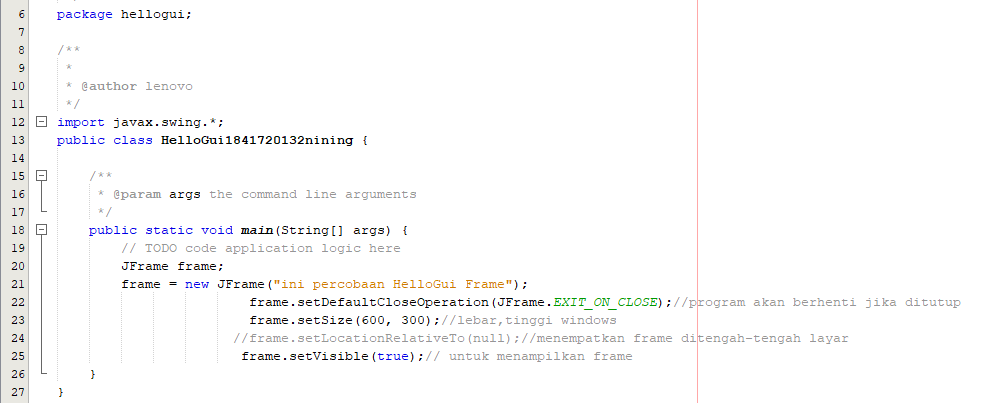 

2. Outputnya

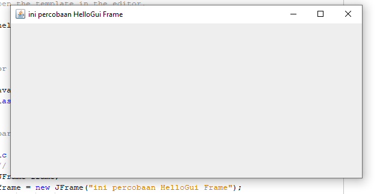 

link kode program : [HelloGUI1841720132nining.java](../../src/11_GUI/HelloGUI1841720132nining.java)

### Percobaan 2 : Menangani Input Pada GUI 

1. Screenshot kode program class MyInputForm1841720132nining.

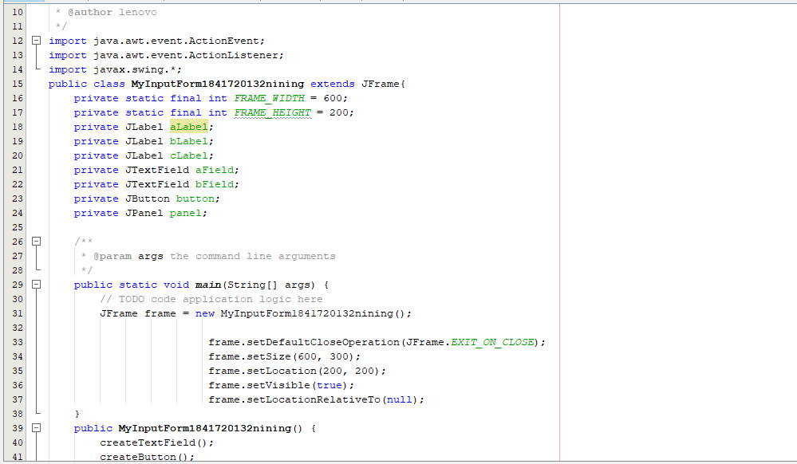 

2. Output/Hasilnya.

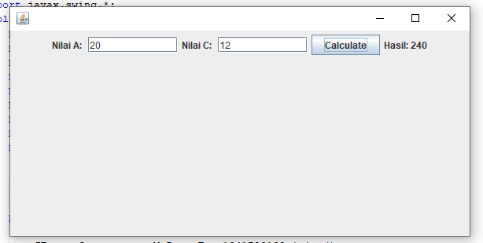 

link kode program : [MyInputForm1841720132nining.java](../../src/11_GUI/MyInputForm1841720132nining.java)

## Pertanyaan

a) Modifikasi kode program dengan menambahkan JButton baru untuk melakukan fungsi perhitungan penambahan, sehingga ketika button di klik (event click) maka akan menampilkan hasil penambahan dari nilai A dan B.

Jawab :
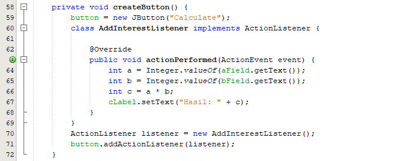 
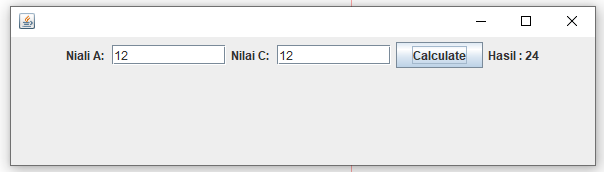 

### Percobaan 3 : Manajemen Layout 

1. Screenshot kode program class Border1841720132nining.

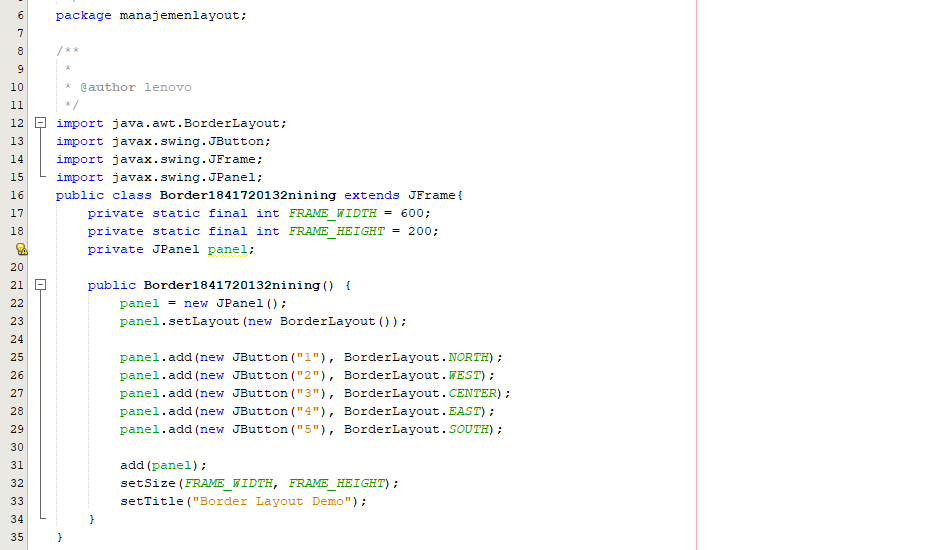

2. Screenshot kode program class Box1841720132nining.

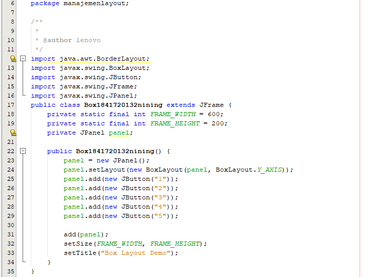

3. Screenshot kode program class Grid1841720132nining.

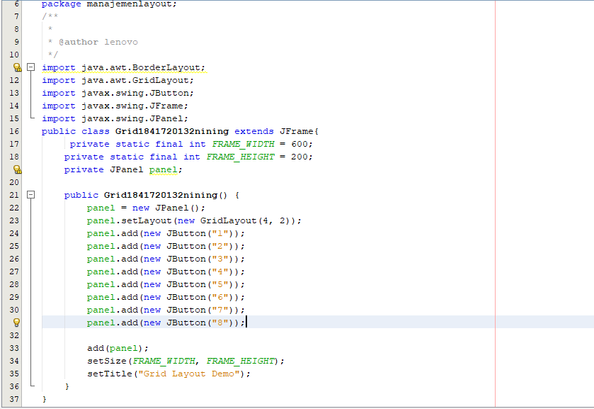

4. Screenshot kode program class Layout1841720132nining.

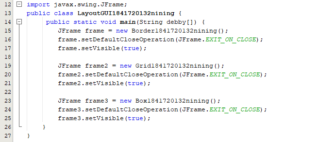

5. Screenshot Output / hasilnya.

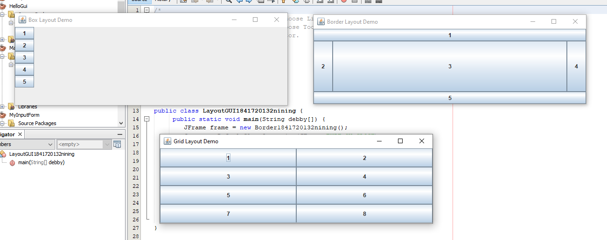

link kode program : [Border1841720132nining.java](../../src/11_GUI/HelloGUI1841720132nining.java)

link kode program : [Box1841720132nining.java](../../src/11_GUI/Box1841720132nining.java)

link kode program : [Grid1841720132nining.java](../../src/11_GUI/Grid1841720132nining.java)

## Pertanyaan

a) Apa perbedaan dari Grid Layout, Box Layout dan Border Layout? 

Jawab: Grid Layout : membuat layout dengan satu kolom per komponen, hanya satu baris yang digunakan
Box Layout : menempatkan komponen dalam satu baris atau satu kolom
Border Layout : menyusun komponen berdasarkan lokasi geografis :  NORH, SOUTH, WEST, EAST, CENTER

b) Apakah fungsi dari masing-masing kode berikut? 
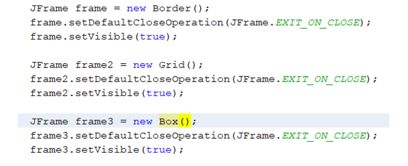 

Jawab: 
 
Untuk menampilkan class Border.

Untuk menampilkan class Grid.

Untuk menampilkan class Box.

### Percobaan 4 : Membuat GUI Melalui IDE Netbeans 

1. Screenshot kode program class Swing1841720132nining.

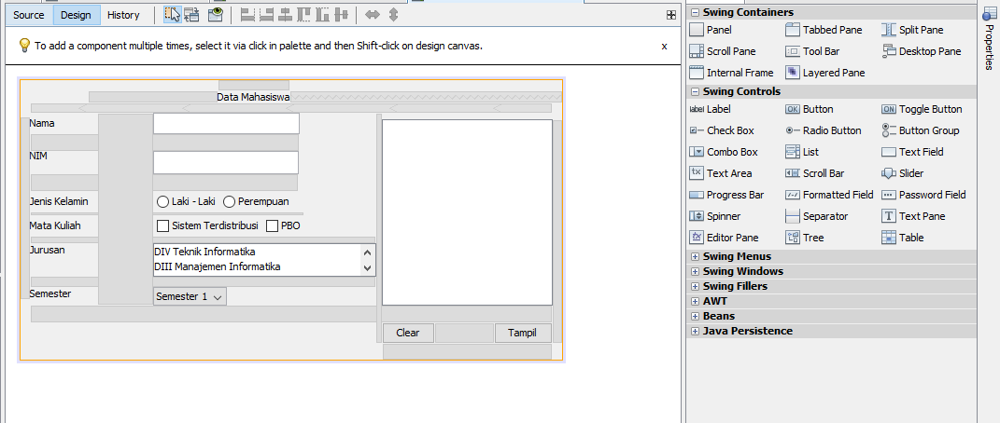 

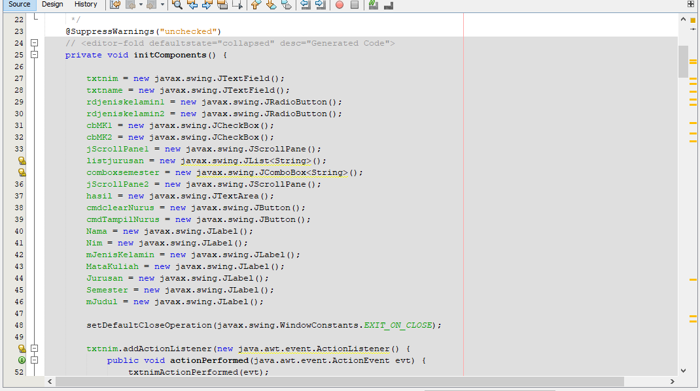

2. Screenshot Output / Hasilnya.

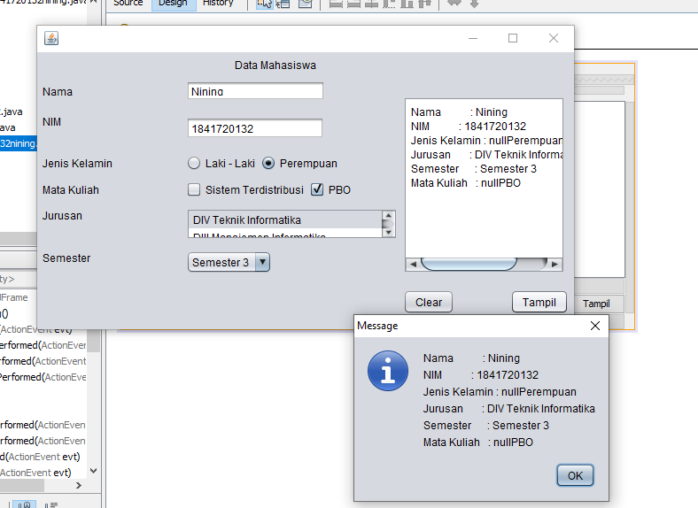 

link kode program : [Swing1841720132nining.java](../../src/11_GUI/HelloGUI1841720132nining.java)

## Pertanyaan

a) Apakah fungsi dari kode berikut? 
 

Jawab: Menampilkan dari JFrame form.

b) Mengapa pada bagian logika checkbox dan radio button digunakan multiple if ? 

Jawab: Karena , agar ceklis atau raddio buttonnya hanya muncul 1 tanda saja.

c) Lakukan modifikasi pada program untuk melakukan menambahkan inputan berupa alamat dan berikan fungsi pemeriksaan pada nilai Alamat tersebut jika belum diisi dengan menampilkan pesan peringatan 

Jawab: 
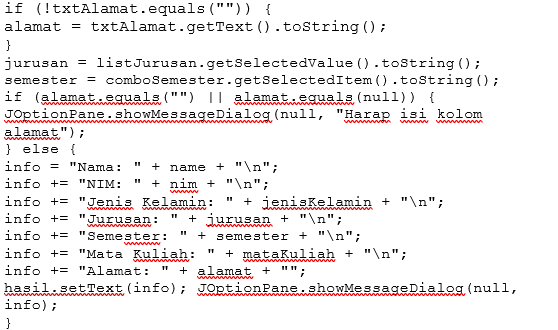 

### Percobaan 5 : JTabPane, JTtree, JTable  

1. Screenshot kode program class Swing21841720132nining.

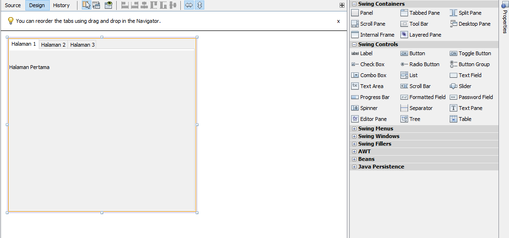 

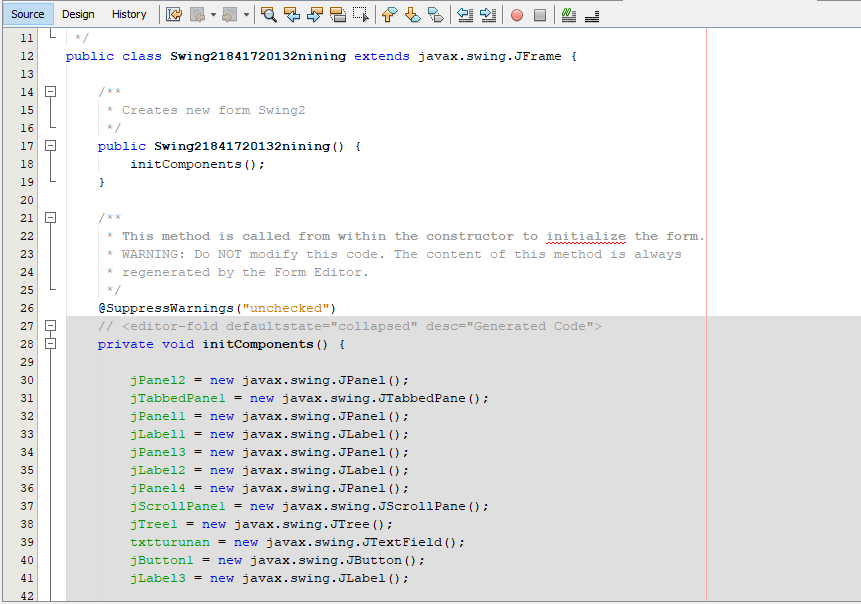

2. Screenshot Output / Hasilnya.

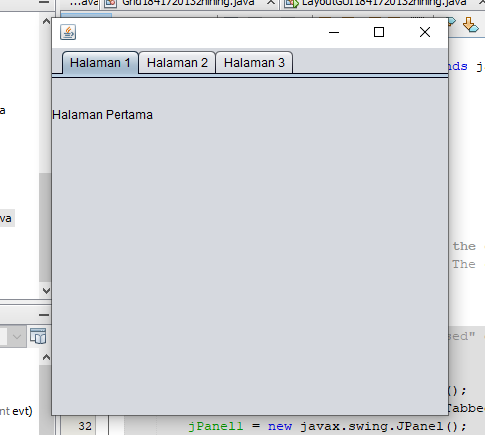 

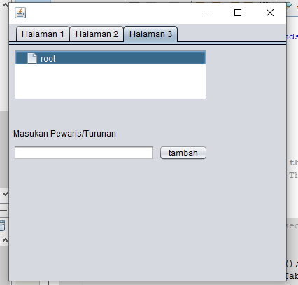 

link kode program : [Swing21841720132nining.java](../../src/11_GUI/Swing21841720132nining.java)

## Assigment

1. Screenshot kode program class Kalkulator1841720132nining.

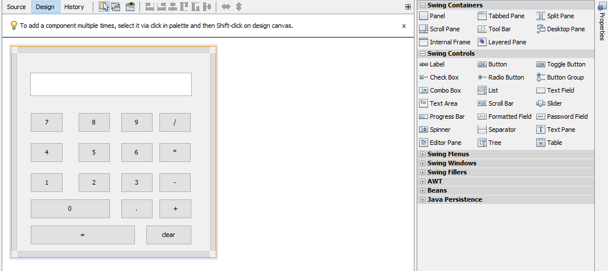 

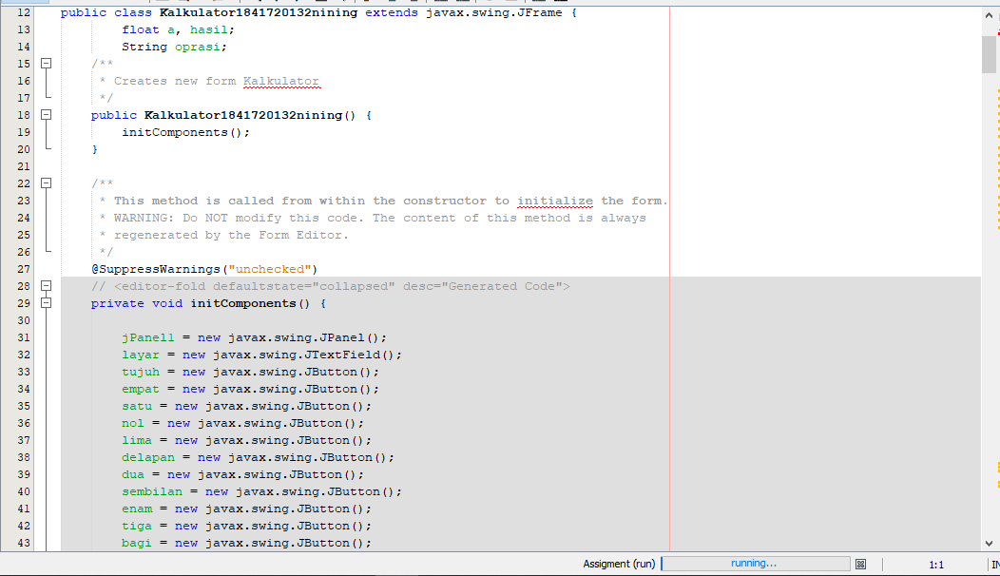 

2. Screenshot Output / hasilnya.

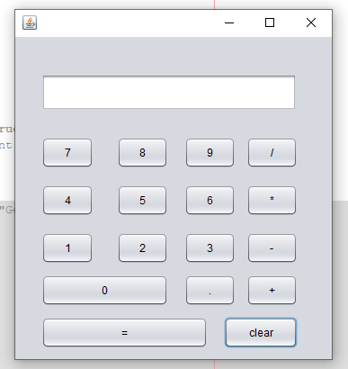 

3. Screenshot kode program class WalkingZombie1841720132nining.

 

link kode program : [Kalkulator1841720132nining.java](../../src/11_GUI/Kalkulator1841720132nining.java)

## Kesimpulan

Kesimpulan yang didapat dari praktikum atau percobaan yang telah dilakukan adalah:
1.	Memahami Graphical User Interface sederhana dengan bahasa pemrograman java.
2.	Memahami komponen GUI seperti frame, label, textfield, combobox, radiobutton, checkbox, textarea, menu, serta table.
3.	Memahami cara membuat event handling pada aplikasi GUI. 

## Pernyataan Diri

Saya menyatakan isi tugas, kode program, dan laporan praktikum ini dibuat oleh saya sendiri. Saya tidak melakukan plagiasi, kecurangan, menyalin/menggandakan milik orang lain.

Jika saya melakukan plagiasi, kecurangan, atau melanggar hak kekayaan intelektual, saya siap untuk mendapat sanksi atau hukuman sesuai peraturan perundang-undangan yang berlaku.

Ttd,

DIMAHYANTI DWI LESTARININGSIH