# Laporan Praktikum #12 - Pengantar Konsep PBO

## Kompetensi

- Memahami cara penyimpanan objek menggunakan Collection dan Map.
- Mengetahui pengelompokan dari Collection.
- Mengetahui perbedaan dari interface Set, List dan Map.
- Mengetahui penggunaan class-class dari interface Set, List, dan Map.
- Memahami koneksi database menggunakan JDBC dan JDBC API

## Ringkasan Materi

List
List adalah jenis array yang membolehkan adanya value duplicate atau nilai yang sama dalam index yang berbeda. List memiliki beberapa fungsi-fungsi yang cukup membantu dalam proses pengolahan nilai-nilai seperti fungsi clear() untuk menghapus semua element atau value pada list, melakukan insert value pada index element tertentu dengan fungsi add(int index, Object element), menghapus value pada index element tertentu dengan fungsi remove(int index) dan masih banyak lagi fungsi lainnya yang mungkin bisa menjawab sesuai kebutuhan kita.

Set
Set adalah jenis array yang tidak membolehkan adanya value duplicate, saat ada insert value yang sudah ada sebelumnya, maka value itu akan terotomatisasi dibuang salah satunya dan akhirnya value tersebut hanya tetap ada satu saja. Set juga memiliki beberapa fungsi yang cukup membantu, seperti clear(), add (Object e), remove(Object e) dan masih banyak lagi fungsi-fungsi lainnya jika teman-teman ingin lebih mengeksplorasi sendiri.

Map
Map adalah jenis array yang indexnya tidak hanya nilai integer 0,1,2 dan seterusnya, melainkan kita dapat melakukan custom pada nilai indexnya, asalkan nilai indexnya adalah selalu unik. Pada jenis array ini masih memiliki kemungkinan terdapat value yang sama (duplicate), karena pada Map ini lebih menekankan index yang harus unik. Jika di dalam pemrograman PHP, kita sering juga menyebut tipe array berjenis ini adalah array asosiatif, selalu memiliki index atau key kemudian value. Map juga memiliki fungsi-fungsi yang cukup membantu seperti clear(), put(Object key, Object value), containsKey(Object key) yaitu mengecek apakah ada elemen pada Map berdasarkan Key atau indexnya, containsValue(Object value) yaitu mengecek apakah ada elemen pada Map berdasarkan Value.

## Praktikum

### Percobaan 1 (Set)

1. Screenshot kode program class DemoHashSet1841720132nining.

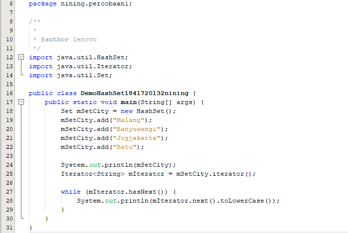 

2. Screenshot Outputnya

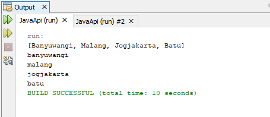 

link kode program : [DemoHashSet1841720132nining.java](../../src/12_Java_API/DemoHashSet1841720132nining.java)

## Pertanyaan 

1. Apakah fungsi import java.util.*; pada program diatas!

Jawab : Mengimport * atau (Hashet, Iterator, Set) kedalam program.

2. Pada baris program keberapakah yang berfungsi untuk menciptakan object HashSet?

Jawab : 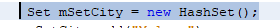 

3. Apakah fungsi potongan program dibawah ini pada percobaan 1!

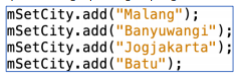 

Jawab : Memberi inputan pada object HashSet

4. Tambahkan set.add(“Malang”); kemudian jalankan program! Amati hasilnya dan jelaskan mengapa terjadi error!

Jawab : Error, karena nama objectnya bukan Set tetapi mSetCity 

5. Jelaskan fungsi potongan program dibawah ini pada percobaan 1!

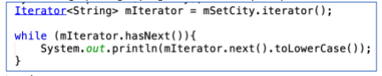 

Jawab : Menginisialisasi Method Iterator yang terdapat pada objek hewan dari Collection ArrayList
Mengecek iterator apakah mempunyai elemen selanjutnya
Jika true maka iterator akan mengambil nilai selanjutnya

### Percobaan 2 (List)

1. Screenshot kode program class CobaArrayList1841720132nining.

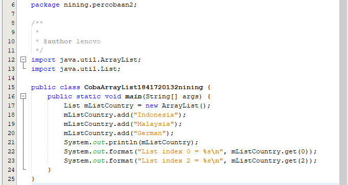 

2. Screenshot Outputnya.

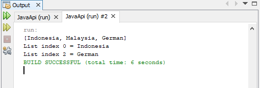 

link kode program : [CobaArrayList1841720132nining.java](../../src/12_Java_API/CobaArrayList1841720132nining.java)

## Pertanyaan

1. Apakah fungsi potongan program dibawah ini!

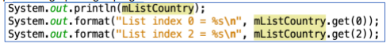 

Jawab : Untuk mengambil isi dari elemen 0 dan elemen 2 dari mListCountry

2. Ganti potongan program pada soal no 1 menjadi sebagai berikut Kemudian jalankan program tersebut!

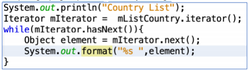 

Jawab : Menginisialisasi Method Iterator yang terdapat pada objek hewan dari Collection ArrayList.
Mengecek iterator apakah mempunyai elemen selanjutnya
Jika true maka iterator akan mengambil nilai selanjutnya.

3. Jelaskan perbedaan menampilkan data pada ArrayList menggunakan potongan program pada soal no 1 dan no 2!

Jawab : 
Soal pertama kita memanggil object 1 persatu menggunakan mListCountry.get(elemen);

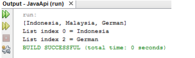 

Sedangkan Soal 2 langsung menggunakan iterator dan perulangan while

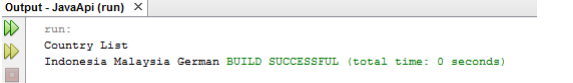 

### Percobaan 3 (Map)

1. Screenshot kode program class DemoHashMap1841720132nining.

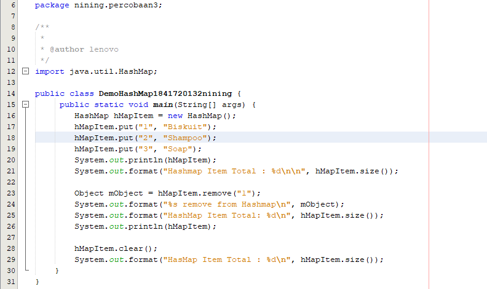

2. Screenshot Outputnya.

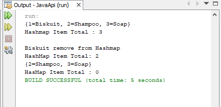

link kode program : [DemoHashMap1841720132nining.java](../../src/12_Java_API/DemoHashMap1841720132nining.java)

## Pertanyaan

1. Jelaskan fungsi hMapItem.put("1","Biskuit") pada program!

Jawab : Untuk mengisi elemen hMapItem dengan 1 , Biskuit

2. Jelaskan fungsi hMapItem.size() pada program!

Jawab : Untuk mengetahui berapa isi dari elemen hMapItem

3. Jelaskan fungsi hMapItem.remove("1") pada program!

Jawab : Untuk menghapus isi di hMapItem 1 yaitu mObject (biskuit)

4. Jelaskan fungsi hMapItem.clear() pada program!

Jawab : Untuk menghapus semua elemen di hMapItem

5. Tambahkan kode program yang di blok pada program yang sudah anda buat!

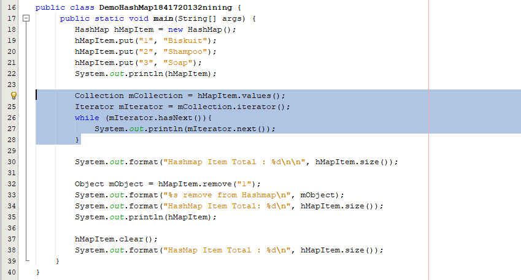 

6. Jalankan program dan amati apa yang terjadi!

Jawab: 

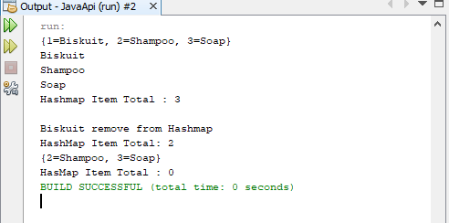 

7.  Apakah perbedaan program sebelumnya dan setelah ditambahkan kode program pada soal no 5 diatas? Jelaskan!

Jawab : Akan tampil isi elemen dari object hMapItem

### Percobaan 4 (Implementasi ArrayList dalam GUI)

1. Screenshot kode program class Mahasiswa1841720132nining.

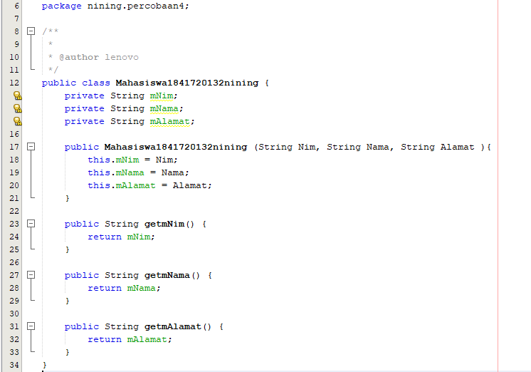 

2. Screenshot kode program class InputData1841720132nining.

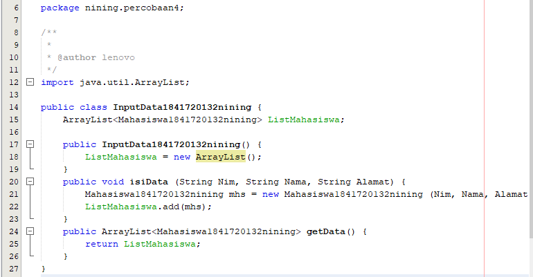 

2. Screenshot kode program class TampilGui1841720132nining.

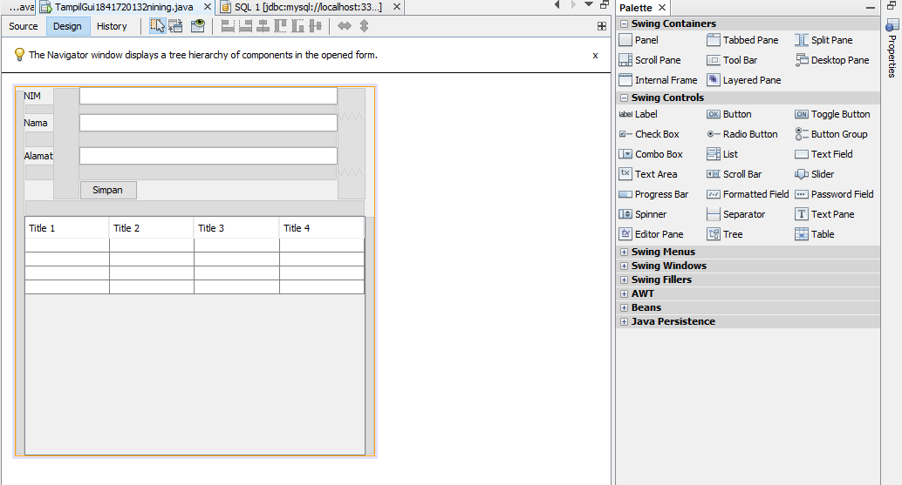 
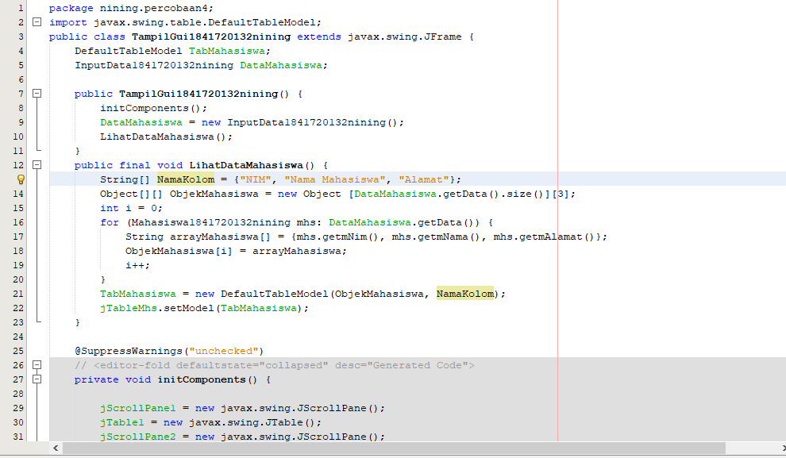

3. Screenshot Output / Hasilnya.

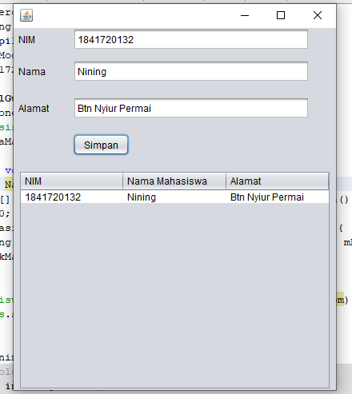 

link kode program : [Mahasiswa1841720132nining.java](../../src/12_Java_API/Mahasiswa1841720132nining.java)

link kode program : [InputData1841720132nining.java](../../src/12_Java_API/InputData1841720132nining.java)

link kode program : [TampilGui1841720132nining.java](../../src/12_Java_API/TampilGui1841720132nining.java)

### Percobaan 5 (Aplikasi Biodata)

1. Screenshot kode program Database MySQL.

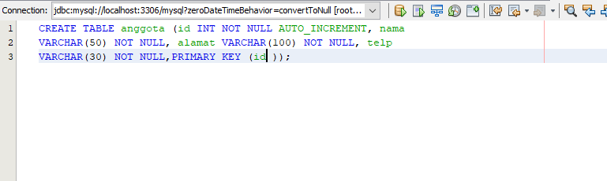 

2. Screenshot kode program class FormKoneksi1841720132nining.

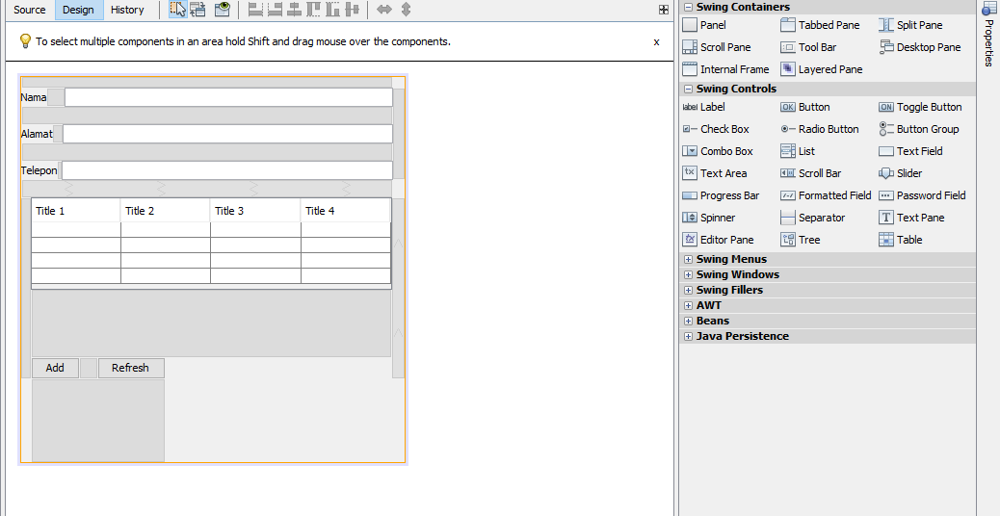 
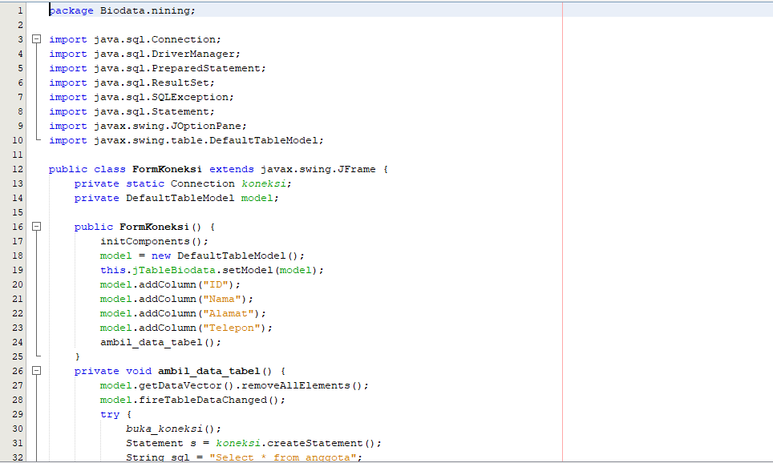 

3. Screenshot Output / Hasilnya.

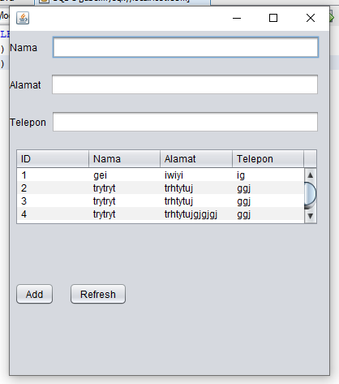 

link kode program : [FormKoneksi1841720132nining.java](../../src/12_Java_API/FormKoneksi1841720132nining.java)

## Pertanyaan

1. Setelah menambah code pada action button klik, coba jalankan program dan tambahkan data. Apakah program berhasil menambahkan data? Jika tidak apakah penyebabnya.

Jawab : Program berhasil ditambahkan, namun tidak dapat menampilkan data dikarenakan belum terdapat method untuk menampilkan data yang sudah di tambahkan

2. Jelaskan maksud source code untuk melakukan insert data diatas?

Jawab : Menjalankan method buka_koneksi(); lalu ditambahkan String sqlkode yang berisi perintah untuk menginsertkan apa yang diisikan id text field nama, alamat, telepon ke tabel anggora. Try catch merupakan sebuah keterangan apabila berhasil(try) dan jika gagal/terjadi kesalahan(catch)

3. Jelaskan alur dari method ambil_data_tabel?

Jawab : Menjalankan method model.getDataVector( .removeAllElements(); model.fireTableDataChanged(); lalu mengeksekusi perintah yang ada pada dalam try, apabila ada kesalah atau gagal maka yg tereksekusi adalah cathc 10 Buat fungsi untuk merefresh sehingga data yang baru dapat ditampilkan pada tabel.

Jawab : Private void jButtonRefreshActionPerformed(java.awt.event.ActionEvent evt){
ambil_data_tabel();
}

## Kesimpulan

Kesimpulan yang didapat dari praktikum atau percobaan yang telah dilakukan adalah:
Kita Memahami cara penyimpanan objek menggunakan Collection dan Map, Mengetahui pengelompokan dari Collection, Mengetahui perbedaan dari interface Set, List dan Map, Mengetahui penggunaan class-class dari interface Set, List, dan Map, dan Memahami koneksi database menggunakan JDBC dan JDBC API.

## Pernyataan Diri

Saya menyatakan isi tugas, kode program, dan laporan praktikum ini dibuat oleh saya sendiri. Saya tidak melakukan plagiasi, kecurangan, menyalin/menggandakan milik orang lain.

Jika saya melakukan plagiasi, kecurangan, atau melanggar hak kekayaan intelektual, saya siap untuk mendapat sanksi atau hukuman sesuai peraturan perundang-undangan yang berlaku.

Ttd,

DIMAHYANTI DWI LESTARININGSIH