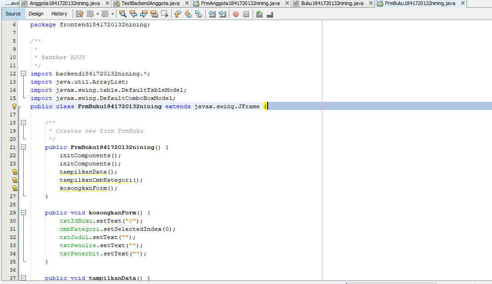
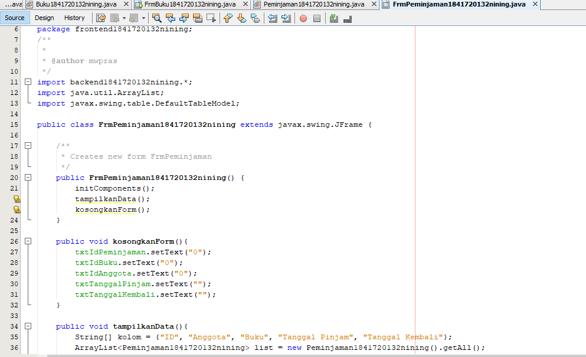

# Laporan Praktikum #12 - Pengantar Konsep PBO

## Kompetensi

Setelah menempuh materi percobaan ini, mahasiswa mampu mengenal: 
1. Menggunakan paradigma berorientasi objek untuk interaksi dengan database,
2. Membuat backend dan frontend,
3. Membuat form sebagai fronten.

## Ringkasan Materi

Kali ini kita akan menggunakan paradigma berorientasi objek yang telah kita pelajari untuk membuat aplikasi berbasis database dan dilengkapi dengan form sebagai Graphical User Interface (GUI). 

Secara umum, tahapan yang akan kita lakukan adalah sebagai berikut: 
1. Membuat database dan tabel-tabelnya. 
2. Membuat backend yang berisi class-class yang mewakili data yang ada pada database, dan class helper untuk melakukan eksekusi query database. 
3. Membuat frontend yang merupakan antarmuka kepada pengguna. Frontend ini bisa berbasis teks (console), GUI, web, mobile, dan sebagainya. 

Library yang digunakan untuk project ini antara lain: 
1. JDBC, untuk melakukan interaksi ke database. 2. ArrayList, untuk menampung data hasil query ke database. 3. Swing, untuk membuat tampilan GUI. 

## Praktikum

### Percobaan 1 (Membuat database)

1. Membuat database dbperpus, dan tabel-tabelnya di phpMyadmin.

 

### Percobaan 2 (Mempersiapkan project)

1. Membuat project baru dengan nama Perpustakaan, mengADD library MYSQL JDBC Driver dan membuat package frontend dan backend.

 

### Percobaan 3 (Membuat class helper untuk mengeksekusi query SQL)

1. Screenshot kode program class DBHelper1841720132nining.

link kode program : [DBHelper1841720132nining.java](../../src/14_GUI_dan_Database/DBHelper1841720132nining.java)

### Percobaan 4 (Membuat class Kategori untuk menghandle CRUD pada tabel kategori)

1. Screenshot kode program class Kategori1841720132nining.

 

link kode program : [Kategori1841720132nining.java](../../src/14_GUI_dan_Database/Kategori1841720132nining.java)

### Percobaan 5 
Mencoba backed yang sudah dibuat dengan mengoperasikannya lewat frontend berbasis teks (console). Percobaan ini dapat anda skip jika anda telah yakin bahwa backend yang anda buat sudah berfungsi dengan baik. 

1. Screenshot kode program class TestBackend1841720132nining.

 

link kode program : [TestBackend1841720132nining.java](../../src/14_GUI_dan_Database/TestBackend1841720132nining.java)

### Percobaan 6 

1. Screenshot kode program class FrmKategori1841720132nining.

 

 

2. Screnshot outputnya.

 

- Hapus

 

- Tambah Baru

 

link kode program : [FrmKategori1841720132nining.java](../../src/14_GUI_dan_Database/FrmKategori1841720132nining.java)

### Percobaan 6 

1. Screenshot kode program class Anggota1841720132nining.

 

2. Screnshot kode program class TestBackendAnggota1841720132nining beserta Outputnya.

link kode program : [Anggota1841720132nining.java](../../src/14_GUI_dan_Database/Anggota1841720132nining.java)

link kode program : [TestBackendAnggota1841720132nining.java](../../src/14_GUI_dan_Database/TestBackendAnggota1841720132nining.java)

### Percobaan 7

1. Screenshot kode program class FrmAnggota1841720132nining.

 

 

2. Screnshot outputnya.

 

- Hapus

 

- Tambah Baru

 

link kode program : [FrmAnggota1841720132nining.java](../../src/14_GUI_dan_Database/FrmAnggota1841720132nining.java)

### Percobaan 8

1. Screenshot kode program class FrmBuku1841720132nining.

 

 

2. Screnshot outputnya.

 

- Hapus

 

- Tambah Baru

 

link kode program : [FrmBuku1841720132nining.java](../../src/14_GUI_dan_Database/FrmBuku1841720132nining.java)

## Tugas

1. Screenshot kode program class FrmPeminjaman1841720132nining.

 

 

2. Screnshot outputnya.

 

link kode program : [FrmPeminjaman1841720132nining.java](../../src/14_GUI_dan_Database/FrmPeminjaman1841720132nining.java)

## Kesimpulan

Kesimpulan yang didapat dari praktikum atau percobaan yang telah dilakukan adalah:
Mengetahun cara Menggunakan paradigma berorientasi objek untuk interaksi dengan database, membuat backend dan frontend, membuat form sebagai fronten.

## Pernyataan Diri

Saya menyatakan isi tugas, kode program, dan laporan praktikum ini dibuat oleh saya sendiri. Saya tidak melakukan plagiasi, kecurangan, menyalin/menggandakan milik orang lain.

Jika saya melakukan plagiasi, kecurangan, atau melanggar hak kekayaan intelektual, saya siap untuk mendapat sanksi atau hukuman sesuai peraturan perundang-undangan yang berlaku.

Ttd,

DIMAHYANTI DWI LESTARININGSIH