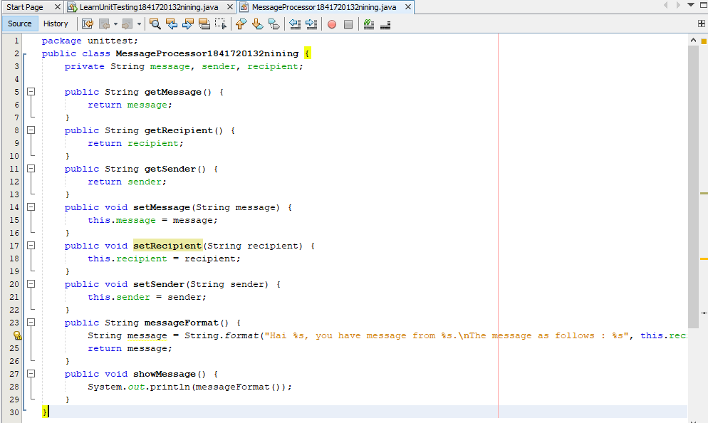
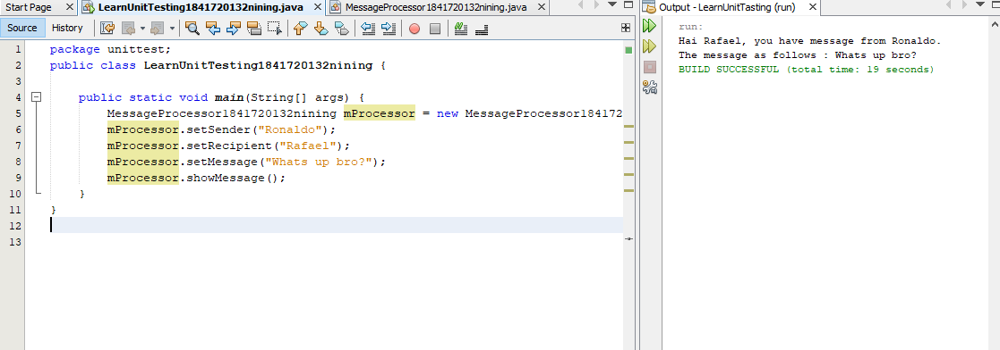
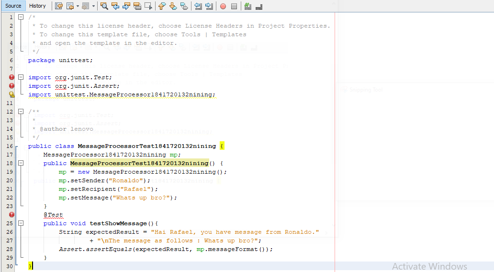
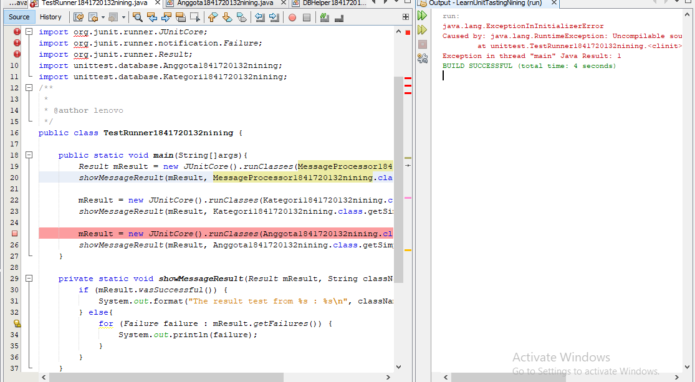
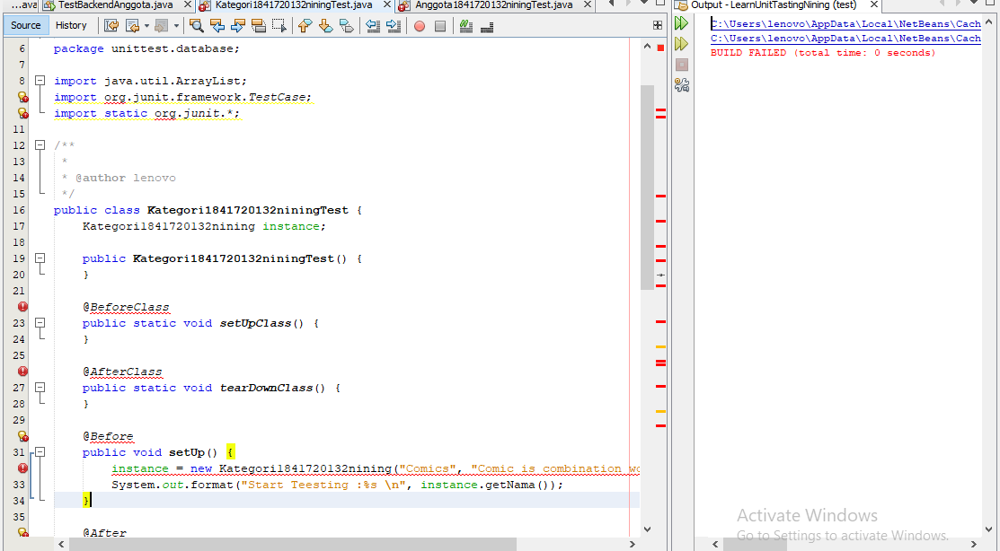
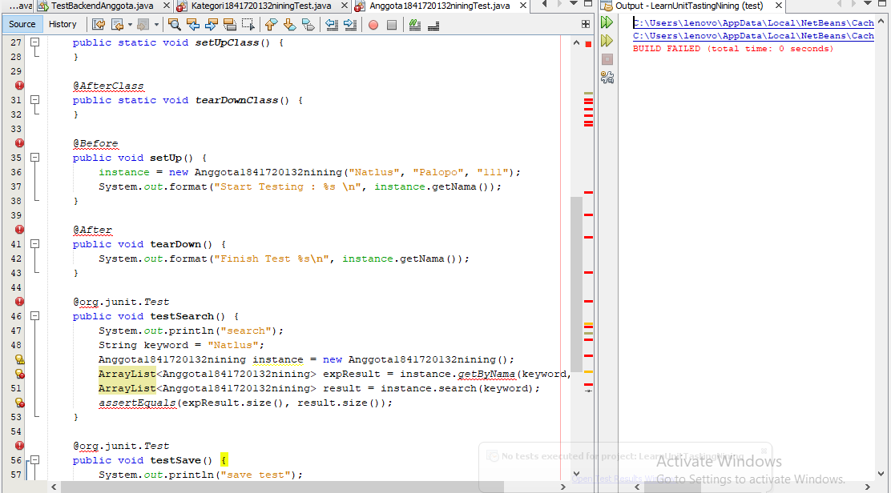

# Laporan Praktikum #15 - Unit Testing

## Kompetensi

1. Memahami konsep dan fungsi unit testing
2. Menerapkan unit testing dengan JUnit pada program sederhana.
3. Menerapkan unit testing dengan JUnit pada progam yang terkoneksi database

## Ringkasan Materi

Unit testing adalah sebuah kode yang ditulis oleh developer, yang digunakan untuk menguji bagian kecil/area spesifik dari suatu aplikasi yang telah/sedang dibuat. Unit testing bertujuan untuk menghilangkan kebutuhan akan pengujian manual kode aplikasi oleh manusia (tester/QC). Sehingga dengan kata lain unit testing adalah usaha untuk mengotomatiskan pengujian kode program (automated test) Kode tes tidak akan dikirimkan ke user, melainkan hanya production code (kode yang digunakan dalam program utama) saja yang dikirim. Unit testing dilakukan setelah programmer selesai menuliskan suatu kode/fungsi/method yang ada dalam suatu class. Dapat juga dilakukan setelah menambahkan sebuah fungsionalitas baru atau setelah melakukan refactoring.

JUnit adalah sebuah framework unit testing untuk bahasa Java yang bersifat open source yang dapat digunakan untuk menulis dan menjalankan software testing secara berulang-ulang. JUnit mengikuti arsitektur xUnit dalam pembuatannya. JUnit dikembangkan oleh Erich Gamma dan Kent Beck. JUnit dapat diperoleh dengan mengunduhnya dari situs disini.

Permasalahan utama yang sering muncul pada pengujian dengan metode konvensional adalah tidak efisiennya penggunaan waktu. Menuliskan statement- statement debug ke dalam kode adalah metode yang kurang efektif. Metode ini mengharuskan developer untuk mengamati output program dengan cermat setiap kali program dijalankan untuk memastikan program berjalan dengan benar. Dengan menggunakan JUnit untuk mengkodekan ekspektasi-ekspektasi dalam bentuk Automated Unit Testing, maka kegiatan pengujian menjadi lebih singkat.

Dalam unit testing, terdapat beberapa aturan penamaan yang harus diikuti. Sebuah test class harus memiliki nama yang sama dengan class yang akan di-test dan diberiprefix “test”. Contoh: Sebuah class Account akan memiliki sebuah test class dengan nama TestAccount.

Penamaan tersebut dimaksudkan untuk mempermudah dalam mengorganisasi unit testing. Sebuah test class harus merupakan turunan (extends) dari class junit.framework.TestCase. Untuk dapat menggunakan semua fungsi yang ada dalam package JUnit, kita harus meng-importjunit.framework.* pada tiap test class yang akan kita tulis.

Test Runner yang digunakan mempunyai fitur untuk mencari sekumpulan test case dalam suatu test class. Agar fitur tersebut dapat berfungsi, kita harus mendefinisikan method TestSuite(), yang mengembalikan instance TestCase atau TestSuite. Keduanya merupakan implementasi dari interface class Test. Test Suite juga dapat digunakan untuk mengeksekusi test method, dimana nama test method tersebut tidak menggunakan kata “test”.

Method assert adalah suatu method yang akan membantu dalam menentukan sebuah method yang sedang ditest/diuji berjalan dengan baik atau tidak. Bila sebuah method mengalami kegagalan, eksekusi dari test method tersebut akan dibatalkan sedangkan test untuk method yang lainnya akan tetap berjalan. 

## Praktikum

### Percobaan 1 : Dasar Unit Tasting

1. Screnshot kode program MessageProcessor1841720132nining.

 

2. Screenshot kode program LearnUnitTesting1841720132nining beserta outputnya.

3. Sreenshot kode program MessageProcessor1841720132niningtest.

4. Screenshot kode program TestRunner1841720132nining beserta outputnya.

link kode program : [MessageProcessor1841720132nining.java](../../src/15_Unit_Testing/MessageProcessor1841720132nining.java)

link kode program : [LearnUnitTesting1841720132nining.java](../../src/15_Unit_Testing/LearnUnitTesting1841720132nining.java)

link kode program : [MessageProcessorTest1841720132nining.java](../../src/15_Unit_Testing/MessageProcessorTest1841720132nining.java)

link kode program : [TestRunner1841720132nining.java](../../src/15_Unit_Testing/TestRunner1841720132nining.java)

### Percobaan 2 : Unit Testing dengan Test Case

1. Screenshot class Kategori1841720132niningtest beserta outputnya.

 

link kode program : [Kategori1841720132nining.java](../../src/15_Unit_Testing/Kategori1841720132nining.java)

link kode program : [DBHelper1841720132nining.java](../../src/15_Unit_Testing/DBHelper1841720132nining.java)

link kode program : [FrmKategori1841720132nining.java](../../src/15_Unit_Testing/FrmKategori1841720132nining.java)

link kode program : [TestBackend1841720132nining.java](../../src/15_Unit_Testing/TestBackend1841720132nining.java)

link kode program : [Anggota1841720132niningTest.java](../../src/15_Unit_Testing/Anggota1841720132niningTest.java)

## Tugas

1. Screenshot kode program class Anggota1841720132niningTest beserta outputnya.

 

link kode program : [Anggota1841720132nining.java](../../src/15_Unit_Testing/Anggota1841720132nining.java)

link kode program : [DBHelper1841720132nining.java](../../src/15_Unit_Testing/DBHelper1841720132nining.java)

link kode program : [FrmAnggota1841720132nining.java](../../src/15_Unit_Testing/FrmAnggota1841720132nining.java)

link kode program : [Anggota1841720132niningtest.java](../../src/15_Unit_Testing/Anggota1841720132niningTest.java)

link kode program : [TestBackendAnggota1841720132nining.java](../../src/15_Unit_Testing/TestBackendAnggota.java)

## Kesimpulan

Kesimpulan yang didapat dari praktikum atau percobaan yang telah dilakukan adalah:
Saya mampu memahami konsep dan fungsi unit testing, mampu menerapkan unittesting dengan jUnit pada program sederhana, dan saya mampu menerapkan unit testing dengan jUnit pada program yang terkoneksi database.

## Pernyataan Diri

Saya menyatakan isi tugas, kode program, dan laporan praktikum ini dibuat oleh saya sendiri. Saya tidak melakukan plagiasi, kecurangan, menyalin/menggandakan milik orang lain.

Jika saya melakukan plagiasi, kecurangan, atau melanggar hak kekayaan intelektual, saya siap untuk mendapat sanksi atau hukuman sesuai peraturan perundang-undangan yang berlaku.

Ttd,

DIMAHYANTI DWI LESTARININGSIH