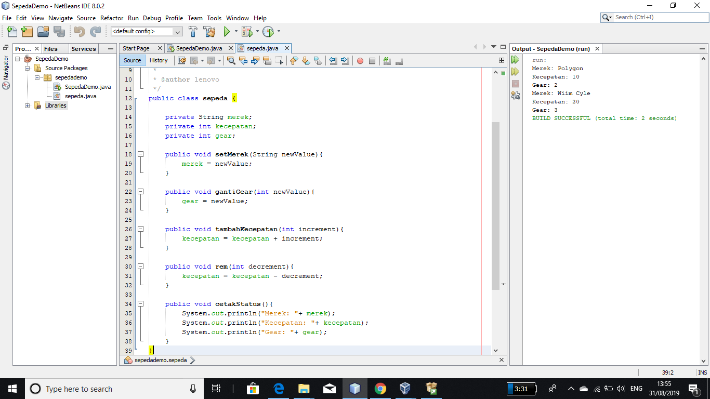
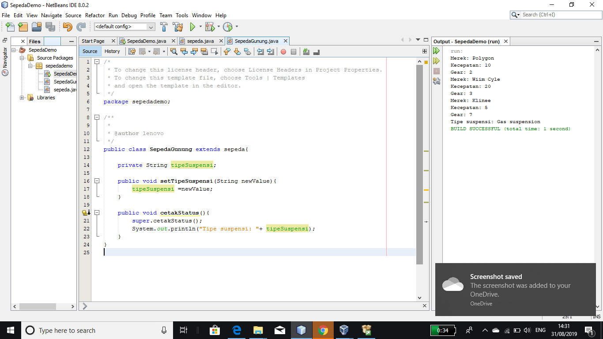
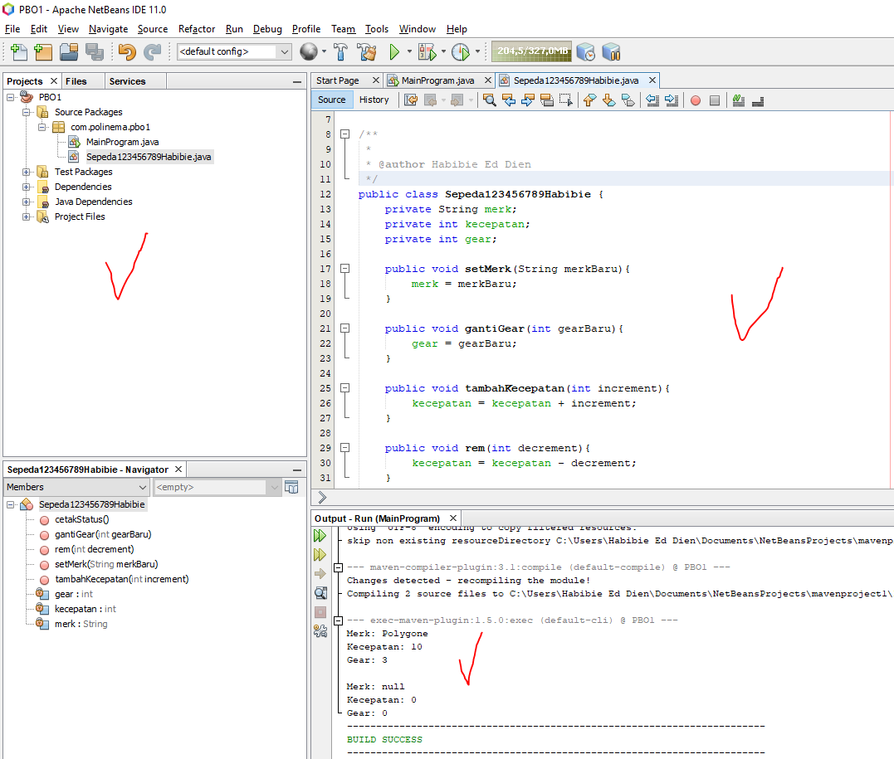

# Laporan Praktikum #1 - Pengantar Konsep PBO

## Kompetensi

(ketiklah kompetensi tiap praktikum di sini)

## Ringkasan Materi

(berisi catatan penting pribadi selama praktikum berlangsung ataupun menemukan permasalahan khusus saat melakukan percobaan)

## Percobaan

### Percobaan 1

(berisi penjelasan percobaan 1. Jika ada rujukan ke file program, bisa dibuat linknya di sini.)

`contoh screenshot yang benar, menampilkan 3 komponen, yaitu struktur project, kode program, dan hasil kompilasi`

(img/2.png)

Contoh link kode program : [ini contoh link ke kode program](../../src/1_Pengantar_Konsep_PBO/SepedaDemo.java)

### Percobaan 2

(berisi penjelasan percobaan 2. Jika ada rujukan ke file program, bisa dibuat linknya di sini.)

`contoh screenshot yang benar, menampilkan 3 komponen, yaitu struktur project, kode program, dan hasil kompilasi`

(img/3.png)

Contoh link kode program : [ini contoh link ke kode program](../../src/1_Pengantar_Konsep_PBO/SepedaGunung.java)

## Pertanyaan

(1. Sebutkan dan jelaskan aspek-aspek yang ada pada pemrograman berorientasi objek! 
Jawab : a. Object Object adalah suatu rangkaian dalam program yang terdiri dari state dan behaviour. Object pada software dimodelkan sedemikian rupa sehingga mirip dengan objek yang ada di dunia nyata. Objek memiliki state dan behaviour.
b. Class Class adalah blueprint atau prototype dari objek. Ambil contoh objek sepeda.
c. Enkapsulasi Disebut juga dengan information-hiding. Dalam berinteraksi dengan objek, seringkali kita tidak perlu mengetahui kompleksitas yang ada didalamnya.
d. Inheritance Disebut juga pewarisan. Inheritance memungkinkan kita untuk mengorganisir struktur program dengan natural.
e. Polimorfisme Polimorfisme juga meniru sifat objek di dunia nyata, dimana sebuah objek dapat memiliki bentuk, atau menjelma menjadi bentuk-bentuk lain. Misalkan saja objek pesawat terbang.

2. Apa yang dimaksud dengan object dan apa bedanya dengan class? 
Jawab : Object adalah pemanfaatan dari class yang siap untuk digunakan, misalnya kita sudah membuat class Roda, yang di dalamnya itu berisi konsep bagaimana Roda itu bisa berjalan, bagaimana Roda itu bisa berputar dan lain-lain, jika semua konsep Roda sudah oke, barulah kita akan dirubah menjadi sebuah Roda yang siap untuk dipakai. Nah itulah yang dinamakan Object Roda. Sedangkan, perbedaannya dengan class Class merupakan kumpulan dari suatu fungsi-fungsi yang dibuat untuk suatu tujuan tertentu. Misalnya kita akan membuat sebuah Mobil. Maka yang perlu kita buatkan adalah beberapa class yang didalamnya berisi fungsi-fungsi yang dapat membuat Mobil itu dapat berjalan sebagaimana mestinya, misalnya class Roda, class Mesin, class Kerangka Mobil, class Body Mobil dan lain lain. 
contoh yang menjelaskan perbedaan Object dan Class.
Object: Manusia
Class: Manusia dapat berjalan, melihat, berlari, memiliki kaki, mata, rambut, hidung, dapat berbicara dan lain-lain.
Object: Komputer
Class: Komputer memiliki layar, prosesor, ram, bisa dimatikan, dihidupkan, bisa memutar musik dan lain-lain.

3. Sebutkan salah satu kelebihan utama dari pemrograman berorientasi objek dibandingkan dengan pemrograman struktural! 
Jawab : Kelebihan PBO adalah program dapat lebih fleksibel dan modular, jika ada perubahan fitur, maka dapat dipastikan keseluruhan program tidak akan terganggu. Berbeda dengan struktural, perubahan sedikit fitur saja kemungkinan dapat mengganggu keseluruhan program.

4. Pada class Sepeda, terdapat state/atribut apa saja? 
Jawab : memiliki state merek, kecepatan, gear dan sebagainya.

5. Tambahkan atribut warna pada class Sepeda. 
Jawab : ! [contoh screenshot] (img/ya.png)

6. Mengapa pada saat kita membuat class SepedaGunung, kita tidak perlu membuat class nya dari nol? 
Jawab : Karena pada class Sepedagunung merupakan turunan dari class sepeda. Keduanya sama, hanya saja pada class sepedagunung terdapat tipe suspense.

## Tugas

(silakan kerjakan tugas di sini beserta `screenshot` hasil kompilasi program. Jika ada rujukan ke file program, bisa dibuat linknya di sini.)

`contoh screenshot yang benar, menampilkan 3 komponen, yaitu struktur project, kode program, dan hasil kompilasi`

Contoh link kode program : [ini contoh link ke kode program](../../src/1_Pengantar_Konsep_PBO/Contoh12345Hab.java)

## Kesimpulan

(Berisi simpulan yang telah diperoleh selama praktikum atau belajar pada pertemuan ini)

## Pernyataan Diri

Saya menyatakan isi tugas, kode program, dan laporan praktikum ini dibuat oleh saya sendiri. Saya tidak melakukan plagiasi, kecurangan, menyalin/menggandakan milik orang lain.

Jika saya melakukan plagiasi, kecurangan, atau melanggar hak kekayaan intelektual, saya siap untuk mendapat sanksi atau hukuman sesuai peraturan perundang-undangan yang berlaku.

Ttd,

***(silakan isi nama lengkap di sini)***