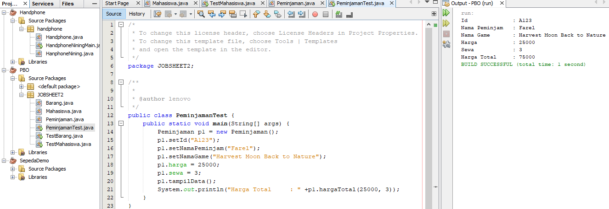

# Laporan Praktikum #2 - Pengantar Konsep PBO

## Kompetensi

 Mahasiswa dapat memahami deskripsi dari class dan object 
 Mahasiswa memahami implementasi dari class 
 Mahasiswa dapat memahami implementasi dari attribute.
 Mahasiswa dapat memahami implementasi dari method. 
 Mahasiswa dapat memahami implementasi dari proses instansiasi. 
 Mahasiswa dapat memahami implementasi dari try-catch. 
 Mahasiswa dapat memahami proses pemodelan class diagram menggunakan UML. 

## Ringkasan Materi

(Di pemrograman berorientasi objek memiliki beberapa konsep yang sangat mendasar untuk kalian ketahui, antara lain sebagai berikut:

1. Class adalah gabungan data dalam satu kesatuan untuk suatu tujuan yang ditentukan. Suatu class itu Greader adalah dasar dari bahan dan struktur dalam pemrograman berorientasi objek tersebut. Sahabat GCI melalui bahan ajar, struktur program akan terkait dengan aspek dalam masalah yang akan diselesaikan melalui program tersebut. Cara ini yang dipakai untuk menyederhanakan masalah pada suatu program.
2. Objek merupakan perangkat data dan fungsi menjadi kesatuan suatu program komputer. Objek itu ialah dasar dari bentuk dan struktur dalam suatu program pada komputer.
3. Abstraksi adalah kemampuan suatu program untuk melewati bagian informasi yang akan diolah olehnya, yaitu kegunaan untuk memfokuskan ke dalam intinya. Proses, fungsi atau cara bisa juga dibuat abstrak, dan beberapa cara untuk dipakai untuk penggembangan program abstrak.
4.Enkapsulasi adalah pembungkusan data yang memastikan pengguna sebuah objek tidak bisa menukar kondisi dari dalam suatu objek dengan cara yang tidak pantas. Tetapi hanya cara yang terdapat di dalam objek itu yang bisa untuk mengakses keadaan.)

### Percobaan 1

1. 

 

2. Class yang bisa dibuat : Karyawan dan Mahasiswa 2 class

3. Class karyawan : +Idkaryawan: int, +nama: String, +jeniskelamin: String, +jabatan: String, +gaji:int

4. tampilData(): void

### Percobaan 2

1. 

link kode program : [Mahasiswa.java](../../src/2_Class_dan_Object/Mahasiswa.java)

link kode program Barang: [TestMahasiswa.java](../../src/2_Class_dan_Object/TestMahasiswa.java)

2. Pendeklarasian atribut pada program di atas :
    
    public class Mahasiswa {
    public int nim;
    public String nama;
    public String alamat;
    public String kelas; 

3.  Pendeklarasian method pada program di atas :
    
    public void tampilBiodata() {
        
        System.out.println("Nim   : " +nim);
        System.out.println("Nama  : " +nama);
        System.out.println("Alamat: " +alamat);
        System.out.println("Kelas : " +kelas);

4. 1 objek yaitu Mahasiswa mhs1 = new Mahasiswa();

5. Yang sebenarnya dilakukan pada sintaks program “mhs1.nim=101" adalah memasukkan data atau nilai pada nim tersebut.

6. Yang sebenarnya dilakukan pada sintaks program “mhs1.tampilBiodata()” adalah menampilkan atau mencetak keselulurahan data yang dimasukkan dalam atribut.

7.  

### Percobaan 3

link kode program : [Barang.java](../../src/2_Class_dan_Object/Barang.java)

link kode program Barang: [TestBarang.java](../../src/2_Class_dan_Object/TestBarang.java)

1. Apakah fungsi argumen dalam suatu method?
    
    Jawab : Kegunaan Argumen didalam sebuah fungsi ialah memberikan nilai yang harus dieksekusi dalam fungsi tersebut.

2.  Ambil kesimpulan tentang kegunaan dari kata kunci return , dan kapan suatu method        harus memiliki return! 
    
    Jawab: Kalau fungsi tanpa nilai balik mengunakan void tanpa ada pernyataan return sedangkan fungsi dengan nilai balik memiliki pernyataan return yang tergantung dengan tipe data yang digunakan. Method yang tidak memiliki nilai kembali/return, bisanya digunakan tidak untuk mencari nilai dalam suatu operasi, untuk mendeklarasikannya kita harus menembahkan kata kunci void.
    

## Tugas

1. Suatu toko persewaan video game salah satu yang diolah adalah peminjaman, dimana data yang dicatat ketika ada orang yang melakukan peminjaman adalah id, nama member, nama game, dan harga yang harus dibayar. Setiap peminjaman bisa menampilkan data hasil peminjaman dan harga yang harus dibayar. Buatlah class diagram pada studi kasus diatas! 

    

2. Buatlah program dari class diagram yang sudah anda buat di no 1! 
    

link kode program : [Peminjaman.java](../../src/2_Class_dan_Object/Peminjaman.java)

link kode program Barang: [PeminjamanTes.java](../../src/2_Class_dan_Object/PeminjamanTest.java)

3. Buatlah program sesuai dengan class diagram berikut ini!

link kode program : [Lingkaran.java](../../src/2_Class_dan_Object/Lingkaran.java)

link kode program Barang: [LingkaranTest.java](../../src/2_Class_dan_Object/LingkaranTest.java)

4. Buatlah program dari class diagram berikut ini! 
    

link kode program : [BarangTgs.java](../../src/2_Class_dan_Object/BarangTgs.java)

link kode program Barang: [BarangTgsTest.java](../../src/2_Class_dan_Object/BarangTgsTest.java)

## Kesimpulan

(Kesimpulan yang saya peroleh yaitu Pemrograman Berorientasi Objek ( PBO ) dalam bahasa inggris dikenal dengan Object Oriented Programming adalah sebuah paradigma pemrograman yang memandang penyelesaian masalah berdasarkan objek yang di targetkan atau hendak di buat. Pemrograman ini digunakan dalam beberapa bahasa Pemrograman seperti C++, Pascal, Java, dan lain lain. Pemrograman berorientasi objek sangat kental kaitannya dengan bahasa pemrograman Java, karena java adalah bahasa pemrograman yang menitik beratkan pada Objeck Oriented Programming atau Pemrograman Berorientasi Objek.)

## Pernyataan Diri

Saya menyatakan isi tugas, kode program, dan laporan praktikum ini dibuat oleh saya sendiri. Saya tidak melakukan plagiasi, kecurangan, menyalin/menggandakan milik orang lain.

Jika saya melakukan plagiasi, kecurangan, atau melanggar hak kekayaan intelektual, saya siap untuk mendapat sanksi atau hukuman sesuai peraturan perundang-undangan yang berlaku.

Ttd,

DIMAHYANTI DWI LESTARININGSIH