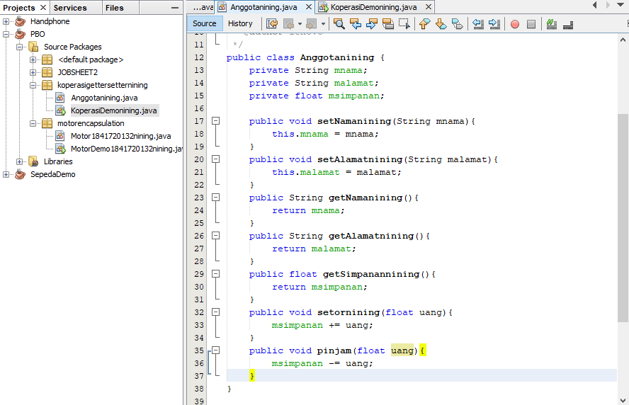
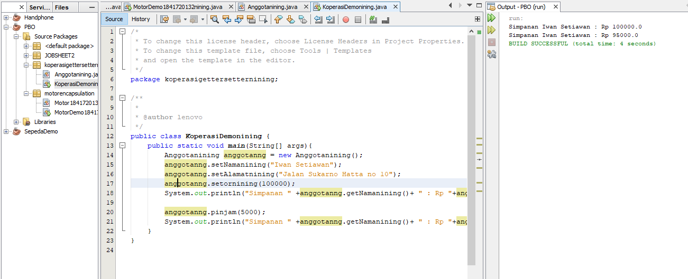

# Laporan Praktikum #3 - Pengantar Konsep PBO

## Kompetensi

Setelah melakukan percobaan pada modul ini, mahasiswa memahami konsep: 
1. Konstruktor 
2. Akses Modifier 
3. Atribut/method pada class 
4. Intansiasi atribut/method  
5. Setter dan getter 
6. Memahami notasi pada UML Class Diagram 

## Ringkasan Materi

Enkapsulasi adalah salah satu yang paling terpenting di dalam pemrograman berorientasi objek(OOP). karena tahap enkapsulasi lah yang menentukan pemberian hak akses pada setiap property atau method. enkapsulasi atau encapsulation pada OOP terdiri dari 3. yaitu : Public, Private dan Protected.
1. Konstruktor mirip dengan method cara deklarasinya akan tetapi tidak memiliki tipe return. Dan konstruktor dieksekusi ketika instan dari objek dibuat. 
2.  Akses Modifier Terdapat 2 tipe modifier di java yaitu : akses modifier dan non-access modifier. 
3. Getter  dan Setter, Getter adalah public method dan memiliki tipe data return, yang berfungsi untuk mendapatkan nilai dari atribut private.
4. Notasi UML Class Diagram

### Percobaan 1

1. 
 

2. 
 

### Percobaan 2

1. 

2. 

### Percobaan 3

1. 

2. 

### Percobaan 4

1. 

2. 

3. 

link kode program : [motorencapsulation](../../src/2_Class_dan_Object/Motor1841720132nining.java)

link kode program : [motorencapsulation](../../src/2_Class_dan_Object/MotorDemo1841720132nining.java)

link kode program : [koperasigettersetternining](../../src/2_Class_dan_Object/Anggotanining.java)

link kode program : [koperasigettersetternining](../../src/2_Class_dan_Object/KoperasiDemonining.java)

## Pertanyaan

1. Apa yang dimaksud getter dan setter?

JAWAB :
Getter adalah mendapatkan atau mengambil atribute private
Setter adalah mengisi suatu nilai

2. Apa kegunaan dari method getSimpanan()?

JAWAB :
Method getSimpanan digunakan untuk mengambil nilai simpanan yg telah diisi

3. Method apa yang digunakan untk menambah saldo?

JAWAB :
public void setor(float uang){
 simpanan +=uang;
 }

4. Apa yand dimaksud konstruktor?

JAWAB :
Konstruktor adalah method yang sama persis namanya dengan classnya

5. Sebutkan aturan dalam membuat konstruktor?

JAWAB :
a. Suatu konstruktor dapat di overload (memiliki beberapa konstruktor asal parameternya beda – beda)

b. Default konstruktor diberikan oleh compiler java

c. Default konstruktor tidak akan diberikan oleh compiler jika pada class tersebut sudah ada
konstruktor

d. Hanya compiler yang membuat default konstruktor

e. Suatu konstruktor tidak dapat di wariskan (inherited)

f. Suatu konstruktor bisa memiliki access modifer private

g. Konstruktor default akan memiliki access modifier yang sama dengan classnya

h. Super() atau this() adalah pernyataan pertama yang harus di panggil dalam konstruktor

6. Apakah boleh konstruktor bertipe private?

JAWAB :
Boleh

7. Kapan menggunakan parameter dengan passsing parameter?

JAWAB :
Ketika atribut membutuhkan nilai yang spesifik

8. Apa perbedaan atribut class dan instansiasi atribut?

JAWAB :
Class suatu blueprint atau cetakan untuk menciptakan suatu instant dari object, sedangkan
instansiasi atribut adalah nilai data yang terdapat pada suatu object yang berasal dari class

9. Apa perbedaan class method dan instansiasi method?

JAWAB :
Class method adalah method yang berada pada suatu class yang menyatakan hal yang bisa
dilakukan seperti menghitung, sedangkan instansiasi yaitu method yang memberi nilai awal
pada suatu atribut

## Tugas

1. 

2. Pada program diatas, pada class EncapTest kita mengeset age dengan nilai 35, namun pada saat
ditampilkan ke layar nilainya 30, jelaskan mengapa ?

JAWAB :
Karena pada method setAge jika umur lebih dari 30 maka yang akan muncul nilai 30. Jika di
bawah 30 maka akan muncul sesuai nilai yang kita masukkan.

3. 

link kode program : [TUGAS](../../src/2_Class_dan_Object/EncapDemoning.java)

link kode program : [TUGAS](../../src/2_Class_dan_Object/EncapNining.java)

4.   

5. 

6. 

link kode program : [TUGAS](../../src/2_Class_dan_Object/AnggotaNining.java)

link kode program : [TUGAS](../../src/2_Class_dan_Object/KoperasiDemoning.java)

link kode program : [TUGAS](../../src/2_Class_dan_Object/KoperasiTestning.java)

## Kesimpulan

Dari percobaan diatas, telah dipelajari kosep dari enkapsulasi, kontruktor, access modifier yang terdiri dari 4 jenis yaitu public, protected, default dan private. Konsep atribut atau method class yang ada di dalam blok code class dan konsep instansiasi atribut atau method. Cara penggunaan getter dan setter beserta fungsi dari getter dan setter. Dan juga telah dipelajari atau memahami notasi UML

## Pernyataan Diri

Saya menyatakan isi tugas, kode program, dan laporan praktikum ini dibuat oleh saya sendiri. Saya tidak melakukan plagiasi, kecurangan, menyalin/menggandakan milik orang lain.

Jika saya melakukan plagiasi, kecurangan, atau melanggar hak kekayaan intelektual, saya siap untuk mendapat sanksi atau hukuman sesuai peraturan perundang-undangan yang berlaku.

Ttd,

DIMAHYANTI DWI LESTARININGSIH