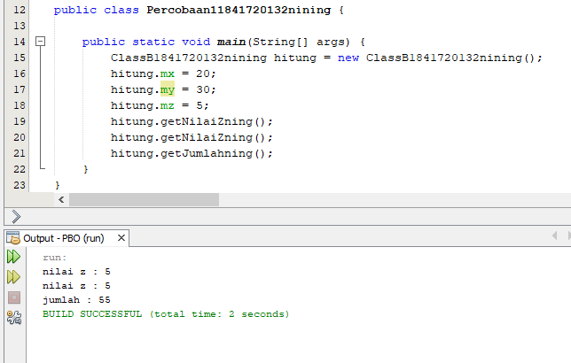
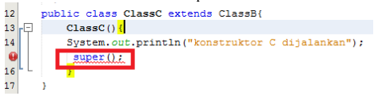

# Laporan Praktikum #6 - Pengantar Konsep PBO

## Kompetensi

1. Memahami	konsep dasar inheritance atau pewarisan.
2. Mampu membuat suatu subclass	dari suatu superclass tertentu.
3. Mampu mengimplementasikan konsep	single dan multilevel inheritance.s
4. Mampu membuat objek dari	suatu subclass dan melakukan pengaksesan terhadap atribut	
dan	method baik	yang dimiliki sendiri atau turunan dari	superclassnya.

## Ringkasan Materi

Inheritance atau pewarisan sifat merupakan suatu cara untuk menurunkan suatu class yang lebih umum menjadi suatu class yang lebih spesifik. Inheritance adalah salah satu ciri utama suatu bahasa program yang berorientasi pada objek. Inti dari pewarisan adalah sifat reusable dari konsep object oriented. Setiap subclass akan “mewarisi” sifat dari superclass selama bersifat protected ataupun public. Dalam inheritance terdapat dua istilah yang sering digunakan. Kelas yang menurunkan disebut kelas dasar (base class/super class), sedangkan kelas yang diturunkan disebut kelas turunan (derived class/sub class/child class) . Di dalam Java untuk mendeklarasikan suatu class sebagai subclass dilakukan dengan cara menambahkan kata kunci extends setelah deklarasi nama class, kemudian diikuti dengan nama parent class-nya. Kata kunci extends tersebut memberitahu kompiler Java bahwa kita ingin melakukan perluasan class. Berikut adalah contoh deklarasi inheritance.

### Percobaan 1

1. Screenshot kode program class ClassA184172012nining.

 

2. Screenshot kode program class ClassB1841720132nining.

 

3. Screenshot kode program class MainPercobaan(1)1841720132nining beserta outputnya.

 

link kode program : [ClassA1841720132nining.java](../../src/6_Inheritance/ClassA1841720132nining.java)

link kode program : [ClassB1841720132nining.java](../../src/6_Inheritance/ClassB1841720132nining.java)

link kode program : [MainPercobaan11841720132nining.java](../../src/6_Inheritance/Percobaan11841720132nining.java)

## Pertanyaan

1. Pada percobaan 2 diatas program yang dijalankan terjadi error, kemudian perbaiki sehingga program tersebut bisa dijalankan dan tidak error! 

Jawab : 
 
 

2. Jelaskan apa penyebab program pada percobaan 1 ketika dijalankan terdapat error! 

Jawab : Program tersebut error karena ClassB merupakan turunan dari ClassA dan Di dalam Java untuk mendeklarasikan suatu class sebagai subclass dilakukan dengan cara menambahkan kata kunci extends jadi didalam ClassB harus mendeklarasikan extends terlebih dahulu.
 

### Percobaan 2

1. Screenshot kode program class ClassA184172012nining.

 

2. Screenshot kode program class ClassB1841720132nining.

 

3. Screenshot kode program class MainPercobaan(2)1841720132nining beserta outputnya.

 

link kode program : [PB2ClassA184172012nining.java](../../src/6_Inheritance/PB2ClassA1841720132nining.java)

link kode program : [PB2ClassB1841720132nining.java](../../src/6_Inheritance/PB2ClassB1841720132nining.java)

link kode program : [MainPercobaan21841720132nining.java](../../src/6_Inheritance/Percobaan21841720132nining.java)

## Pertanyaan

1.	Pada percobaan 2 diatas program yang dijalankan terjadi error, kemudian perbaiki sehingga program tersebut bisa dijalankan dan tidak error! 

Jawab : 

    
2.	Jelaskan apa penyebab program pada percobaan 1 ketika dijalankan terdapat error! 

Jawab : Program tersebut error karena ClassB merupakan turunan dari ClassA dan di dalam Java untuk mendeklarasikan suatu class sebagai subclass dilakukan dengan cara menambahkan kata kunci extends jadi didalam ClassB harus mendeklarasikan extends terlebih dahulu, karena atribut pada ClassA menggunakan modifier private maka harus di kasih getter untuk memanggil nilai di class lain.

### Percobaan 3

1. Screenshot kode program class Bangun.

2. Screenshot kode program class Tabung.

 

3. Screenshot kode program class MainPercobaan3 dan beserta outputnya.

  

link kode program : [PB3Bangun1841720132nining.java](../../src/6_Inheritance/Bangun1841720132nining.java)

link kode program : [PB3Tabung1841720132nining.java](../../src/6_Inheritance/Tabung1841720132nining.java)

link kode program : [MainPercobaan31841720132nining.java](../../src/6_Inheritance/Percobaan31841720132nining.java)

## Pertanyaan

1.	Jelaskan fungsi “super” pada potongan program berikut di class Tabung! 

Jawab : Super.phi = phi; digunakan untuk mengakses atribut dari parent class /superclass  dan mengisi nilai phi Super.r = r; digunakan untuk mengakses atribut dari parent class /superclass  dan mengisi nilai r.

2.	Jelaskan fungsi “super” dan “this” pada potongan program berikut di class Tabung! 

Jawab : Fungsi “super” adalah Merujuk/mengakses atribut dari parent class /superclass Fungsi “this” adalah Merujuk/mengakses atribut dari class itu sendiri.

3.	 Jelaskan mengapa pada class Tabung tidak dideklarasikan atribut “phi” dan “r” tetapi class tersebut dapat mengakses atribut tersebut! 

Jawab : Karena class Tabung merupakan subclass dari class Bangun jadi kita tidak perlu mendeklarasikan lagi kita cukup mendeklarasikan suatu class sebagai subclass dilakukan dengan cara menambahkan kata kunci extends.
 

### Percobaan 4

1. Screenshot kode program class ClassA.

2. Screenshot kode program class ClassB.

 

3. Screenshot kode program class ClassC.

 

4. Screenshot kode program class MainPercobaan4 dan beserta outputnya.

 

link kode program : [PB4ClassA1841720132nining.java](../../src/6_Inheritance/PB4ClassA1841720132nining.java)

link kode program : [PB4ClassB1841720132nining.java](../../src/6_Inheritance/PB4ClassB1841720132nining.java)

link kode program : [PB4ClassC1841720132nining.java](../../src/6_Inheritance/PB4ClassC1841720132nining.java)

link kode program : [MainPercobaan41841720132nining.java](../../src/6_Inheritance/Percobaan41841720132nining.java)

## Pertanyaan

1.	Pada percobaan 4 sebutkan mana class yang termasuk superclass dan subclass, kemudian jelaskan alasannya! 

Jawab : SuperClass adalah ClassA karena ClassA tidak mempunyai subclass  Yang termasuk subclass adalah ClassB dan ClassC Karena ClassB merupakan subclass dari classA dan ClasssC merupakan subclass dari classB.

2.	Ubahlah isi konstruktor default ClassC seperti berikut: 
  
 Tambahkan kata super() di baris Pertaman dalam konstruktor defaultnya. Coba jalankan kembali class Percobaan4 dan terlihat tidak ada perbedaan dari hasil outputnya!

Jawab :  

3.	Ubah isi konstruktor default ClassC seperti berikut: 
     
    Ketika mengubah posisi super() dibaris kedua dalam kontruktor defaultnya dan terlihat ada error. Kemudian kembalikan super() kebaris pertama seperti sebelumnya, maka errornya akan hilang. Perhatikan hasil keluaran ketika class Percobaan4 dijalankan. Kenapa bisa tampil output seperti berikut pada saat instansiasi objek test dari class ClassC.
     
    Jelaskan bagaimana urutan proses jalannya konstruktor saat objek test dibuat!

Jawab : Jika super() digunakan dibaris kedua dalam kontruktor maka akan error karena super() Hanya bisa digunakan dibaris pertama dalam kontruktor. 

4.	Apakah fungsi super() pada potongan program dibawah ini di ClassC! 
     

Jawab : Fungsi super() Merujuk / memanggil konstruktor parent class /superclass.

### Percobaan 5

1. Screenshot kode program class Karyawan.

2. Screenshot kode program class Manajer.

 

3. Screenshot kode program class Staff.

 

4. Screenshot kode program class MainPercobaan5 dan beserta outputnya.

 

link kode program : [Karyawan1841720132nining.java](../../src/6_Inheritance/Karyawan1841720132nining.java)

link kode program : [Manajer1841720132nining.java](../../src/6_Inheritance/Manajer1841720132nining.java)

link kode program : [Staff1841720132nining.java](../../src/6_Inheritance/Staff1841720132nining.java)

link kode program : [MainPercobaan51841720132nining.java](../../src/6_Inheritance/Inheritance11841720132nining.java)

## Pertanyaan

1.	PSebutkan class mana yang termasuk super class dan sub class dari percobaan 1 diatas! 

Jawab : Superclass adalah class Karyawan Subclass adalah class Manager dan Staff 

2.	 Kata kunci apakah yang digunakan untuk menurunkan suatu class ke class yang lain? 

Jawab : Kata kunci yang digunakan untuk menurunkan suatu class ke class yang lain adalah kata kunci extends 

3.	Perhatikan kode program pada class Manager, atribut apa saja yang dimiliki oleh class tersebut? Sebutkan atribut mana saja yang diwarisi dari class Karyawan 

Jawab : Atribut yang dimiliki class Manager adalah tunjangan Atribut yang diwarisi class Karyawan adalah gaji 

4.	Jelaskan kata kunci super pada potongan program dibawah ini yang terdapat pada class Manager 
     

Jawab : Kata kunci super tersebut digunakan untuk mengakses atribut gaji dari class Karyawan.

5. Program pada percobaan 1 diatas termasuk dalam jenis inheritance apa? Jelaskan alasannya! 

Jawab : Termasuk Single inheritance karena Suatu class yang hanya mempunyai satu parent class.

### Percobaan 6

1. Screenshot kode program class StaffTetap.

2. Screenshot kode program class StaffHarian.

 

3. Screenshot kode program class Main Inheritance dan beserta outputnya.

 

link kode program : [StaffTetap1841720132nining.java](../../src/6_Inheritance/StaffTetap1841720132nining.java)

link kode program : [StaffHarian1841720132nining.java](../../src/6_Inheritance/StaffHarian1841720132nining.java)

link kode program : [MainPercobaan61841720132nining.java](../../src/6_Inheritance/Inheritance1841720132nining.java)

## Pertanyaan

1.	Berdasarkan class diatas manakah yang termasuk single inheritance dan mana yang termasuk multilevel inheritance?

Jawab : Yang termasuk single inheritance adalah class Staff Yang termasuk multilevel clas StaffHarian dan Stafftetap 

2.	 Perhatikan kode program class StaffTetap dan StaffHarian, atribut apa saja yang dimiliki oleh class tersebut? Sebutkan atribut mana saja yang diwarisi dari class Staff! 

Jawab : Atribut yang dimiliki class StaffTetap adalah jmlJamKerja Atribut yang dimiliki class StaffHarian adalah golongan dan asuransi Atribut yang diwarisi dari class Staff adalah lembur dan potongan.

3.	Apakah fungsi potongan program berikut pada class StaffHarian 
     

Jawab : Fungsi program berikut yaitu untuk memanggil konstruktor berparamter dari superklas 

4.	Jelaskan kata kunci super pada potongan program dibawah ini yang terdapat pada class Manager 
     

Jawab : Fungsi program berikut yaitu memanggil method dari parent class /superclass.

5. Perhatikan kode program dibawah ini yang terdapat pada class StaffTetap .Terlihat dipotongan program diatas atribut gaji, lembur dan potongan dapat diakses langsung. Kenapa hal ini bisa terjadi dan bagaimana class StaffTetap memiliki atribut gaji, lembur, dan potongan padahal dalam class tersebut tidak dideklarasikan atribut gaji, lembur, dan potongan? 

Jawab : Karena pada class StaffTetap sudah deklarasikan menggunakan super  jadi kita tidak perlu mendeklarasikan lagi 

## Tugas

1. Buatlah sebuah program dengan konsep a class Mac, Windows dan Pc!. 
 

 Jawab: 
 
 - Class Komputer
 

 - Class Laptop
 

 - Class Mac
 

 - Class PC
 

 - Class Windows
 
 
 - Class Main Inheritance dan Outputnya
 

link kode program : [Komputer1841720132nining.java](../../src/6_Inheritance/Komputer1841720132nining.java)

link kode program : [Laptop1841720132nining.java](../../src/6_Inheritance/Laptop1841720132nining.java)

link kode program : [Mac1841720132nining.java](../../src/6_Inheritance/Mac1841720132nining.java)

link kode program : [PC1841720132nining.java](../../src/6_Inheritance/Pc1841720132nining.java)

link kode program : [Windows1841720132nining.java](../../src/6_Inheritance/Windows1841720132nining.java)

link kode program : [MainTugas1841720132nining.java](../../src/6_Inheritance/InheritanceMain1841720132nining.java)

## Kesimpulan

Kesimpulan yang didapat setelah melakukan praktikum adalah: 
boleh dikatakan bahwa suatu subclass adalah tidak lain hanya memperluas (extend) parent class-nya.

Dari hirarki diatas dapat dilihat bahwa, semakin kebawah, class akan semakin bersifat spesifik. Class mamalia memiliki seluruh sifat yang dimiliki oleh binatang, demikian halnya juga macan , kucing, Paus dan Monyet memiliki seluruh sifat yang diturunkan dari class mamalia.

Dengan konsep ini, karakteristik yang dimiliki oleh class binatang cukup didefinisikan didefinisikan dalam class binatang saja.

Dengan memanfaatkan konsep pewarisan ini dalam pemrograman, maka hanya perlu mendefinisikan karakteristik yang lebih umum akan didapatkan dari class darimana ia diturunkan.

## Pernyataan Diri

Saya menyatakan isi tugas, kode program, dan laporan praktikum ini dibuat oleh saya sendiri. Saya tidak melakukan plagiasi, kecurangan, menyalin/menggandakan milik orang lain.

Jika saya melakukan plagiasi, kecurangan, atau melanggar hak kekayaan intelektual, saya siap untuk mendapat sanksi atau hukuman sesuai peraturan perundang-undangan yang berlaku.

Ttd,

DIMAHYANTI DWI LESTARININGSIH