# Laporan Praktikum #7 - Pengantar Konsep PBO

## Kompetensi

Setelah menempuh pokok bahasan ini, mahasiswa mampu : 

a. Memahami konsep overloading dan overriding,

b. Memahami perbedaan overloading dan overriding, 

c. Ketepatan dalam mengidentifikasi method overriding dan overloading,

d. Ketepatan dalam mempraktekkan instruksi pada jobsheet 

e. Mengimplementasikan method overloading dan overriding. 

## Ringkasan Materi

Overloading  adalah menuliskan kembali method dengan nama yang sama pada suatu class. Tujuannya dapat memudahkan penggunaan/pemanggilan method dengan fungsionalitas yang mirip. 
Untuk aturan pendeklarasian method Overloading sebagai berikut: 
* Nama method harus sama. 

* Daftar parameter harus berbeda. 

* Return type boleh sama, juga boleh berbeda. 

 Overriding  adalah Sublass yang berusaha memodifkasi tingkah laku yang diwarisi dari superclass. Tujuannya subclass dapat memiliki tingkah laku yang lebih spesifik sehingga dapat dilakukan dengan cara mendeklarasikan kembali method milik parent class di subclass. Deklarasi method pada subclass harus sama dengan yang terdapat di super class. 
 Kesamaan pada: 
 * Nama 

 * Return type (untuk return type : class A atau merupakan subclass dari class A) 

 * Daftar parameter (jumlah, tipe dan urutan) 

## Praktikum

### Percobaan 1
Untuk kasus contoh berikut ini, terdapat tiga kelas, yaitu Karyawan, Manager, dan Staff. Class Karyawan merupakan superclass dari Manager dan Staff dimana subclass Manager dan Staff memiliki method untuk menghitung gaji yang berbeda. 

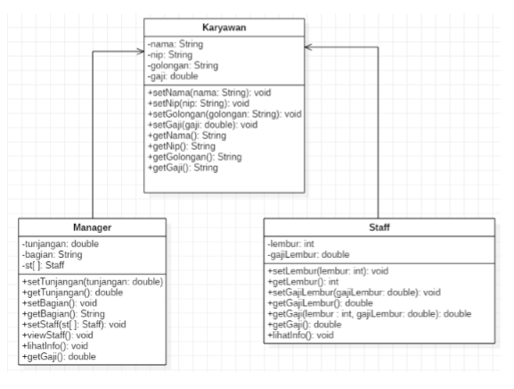 

1. Screenshot kode program class Karyawan184172012nining.

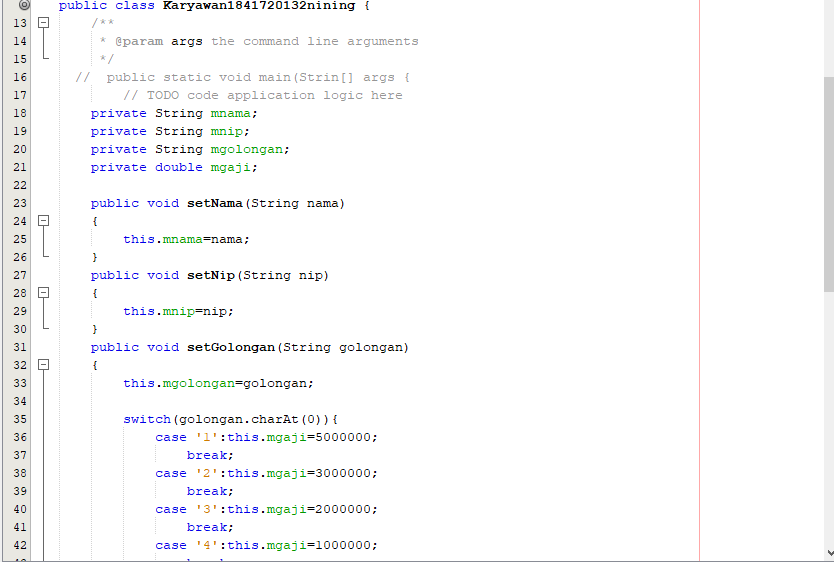 

2. Screenshot kode program class Staff1841720132nining.

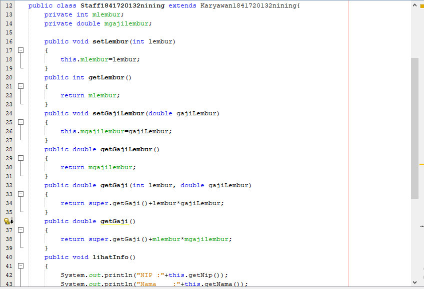 

3. Screenshot kode program class Manager1841720132nining

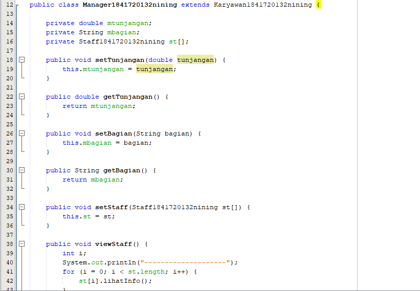 

4. Screenshot kode program class Utama1841720132nining beserta outputnya.

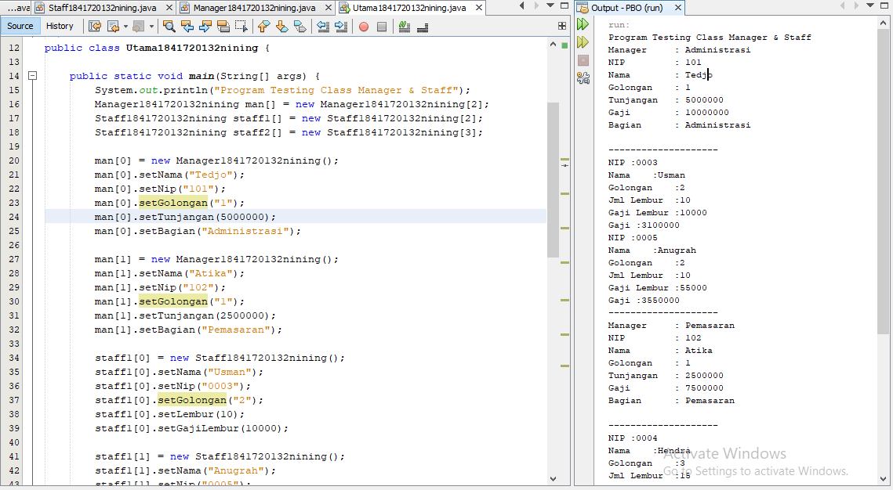 

link kode program : [Karyawan1841720132nining.java](../../src/7_Overriding_dan_Overloading/Karyawan1841720132nining.java)

link kode program : [Staff1841720132nining.java](../../src/7_Overriding_dan_Overloading/Staff1841720132nining.java)

link kode program : [Manager1841720132nining.java](../../src/7_Overriding_dan_Overloading/Manager1841720132nining.java)

link kode program : [Utama1841720132nining.java](../../src/7_Overriding_dan_Overloading/Utama1841720132nining.java)

## Latihan

### Latihan 1
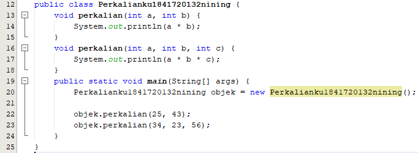 

1. Dari source coding diatas terletak dimanakah overloading?

Jawab : 
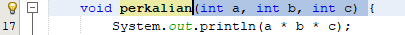
Terdapat overloading, terdapat 2 parameter yang digunakan dalam method, yaitu terdapat pada baris ke-2 dan ke-4. 
 
2. Jika terdapat overloading ada berapa jumlah parameter yang berbeda?

Jawab : Terdapat 2 parameter yang digunakan dalam method, yaitu terdapat pada baris ke-2 dan ke-4. 

3. Dari source coding diatas terletak dimanakah overloading? 

Jawab:

Overloading terdapat di syntax ke-2 dan ke-4. 

4. Jika terdapat overloading ada berapa tipe parameter yang berbeda? 

Jawab: Parameter yang 1 menggunakan tipe parameter integer dan parameter yang kedua menggunakan tipe parameter double.

### Latihan 2
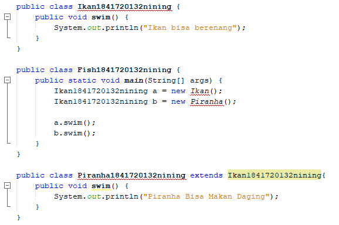 

1.  Dari source coding diatas terletak dimanakah overriding? 

Jawab: 
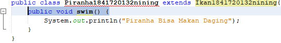
Terletak yaitu pada method swim() di class Piranha. 

2. Jabarkanlah apabila sourcoding diatas jika terdapat overriding? 

Jawab: Terdapat overriding, yaitu pada method swim() di class Piranha. Disebut method overriding karena nama method tersebut sama dengan method di superclassnya akan tetapi berbeda di isi methodnya. 

## Tugas

#### Overloading 
Implementasikan konsep overloading pada class diagram dibawah ini : 
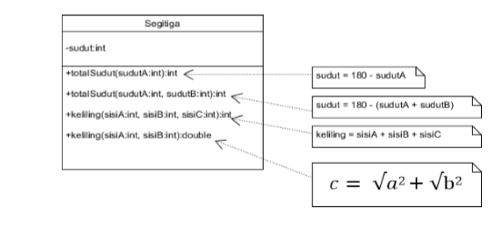

 Jawab: 
 
 - Class Segitiga
 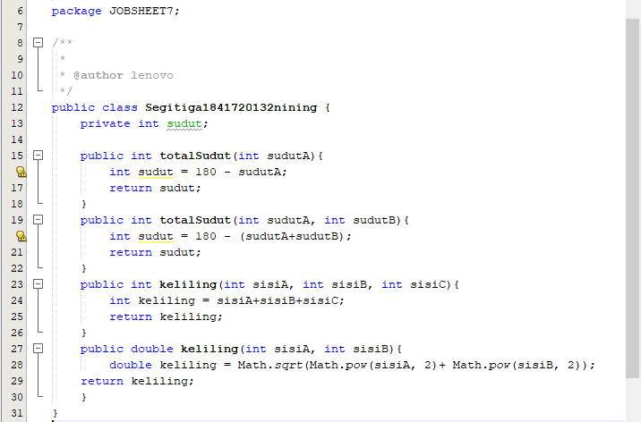

 - Class Main Segitiga
 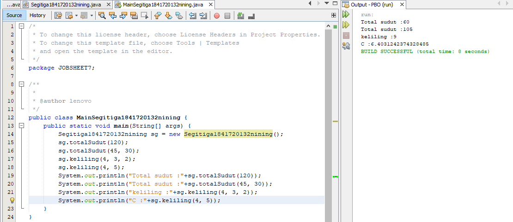

link kode program : [Segitiga1841720132nining.java](../../src/7_Overriding_dan_Overloading/Segitiga1841720132nining.java)

link kode program : [MainSegitiga1841720132nining.java](../../src/7_Overriding_dan_Overloading/MainSegitiga1841720132nining.java)

#### Overriding
Implementasikan class diagram dibawah ini dengan menggunakan teknik dynamic method dispatch : 
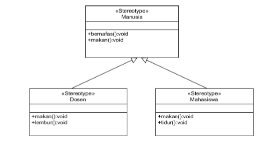

Jawab: 
 
 - Class Manusia
 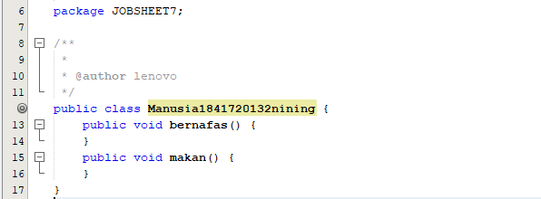

 - Class Main Dosen
 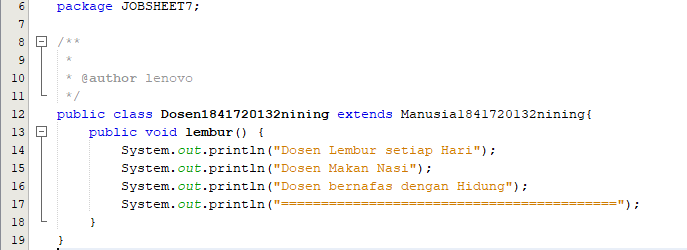

  - Class Main Mahasiswa
 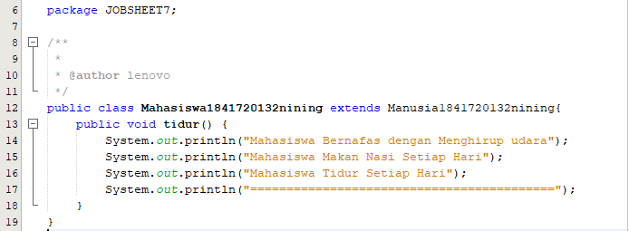

  - Class Main Main
 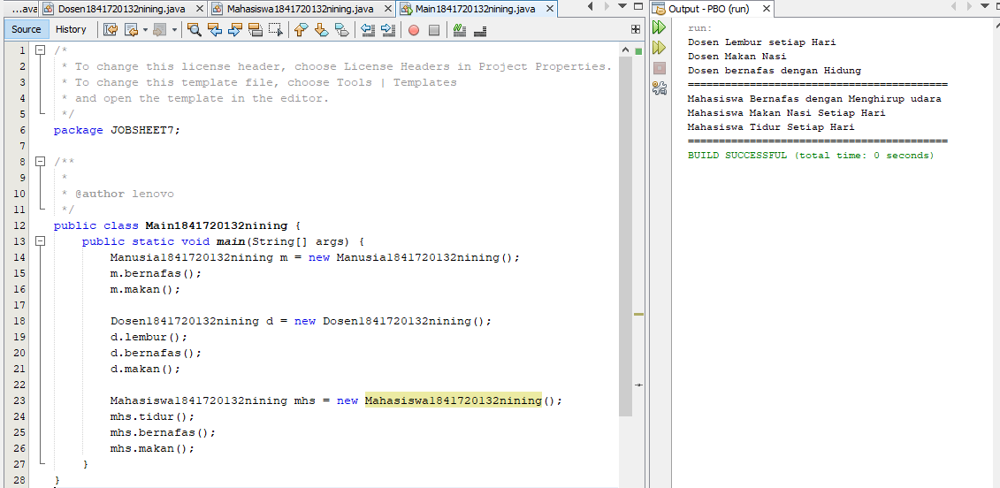

link kode program : [Manusia1841720132nining.java](../../src/7_Overriding_dan_Overloading/Manusia1841720132nining.java)

link kode program : [Dosen1841720132nining.java](../../src/7_Overriding_dan_Overloading/Dosen1841720132nining.java)

link kode program : [Mahasiswa1841720132nining.java](../../src/7_Overriding_dan_Overloading/Mahasiswa1841720132nining.java)

link kode program : [Main1841720132nining.java](../../src/7_Overriding_dan_Overloading/Main1841720132nining.java)

## Kesimpulan

Kesimpulan yang didapat dari praktikum atau percobaan yang telah dilakukan adalah: 
1. Memahami konsep overloading dan overriding. 
2. Memahami perbedaan overloading dan overriding. 
3. Mampu mengimplementasikan method-method overloading dan overriding. 

## Pernyataan Diri

Saya menyatakan isi tugas, kode program, dan laporan praktikum ini dibuat oleh saya sendiri. Saya tidak melakukan plagiasi, kecurangan, menyalin/menggandakan milik orang lain.

Jika saya melakukan plagiasi, kecurangan, atau melanggar hak kekayaan intelektual, saya siap untuk mendapat sanksi atau hukuman sesuai peraturan perundang-undangan yang berlaku.

Ttd,

DIMAHYANTI DWI LESTARININGSIH