# Laporan Praktikum #9 - Pengantar Konsep PBO

## Kompetensi

Setelah menyelesaikan lembar kerja ini mahasiswa diharapkan mampu: 
1. Menjelaskan maksud dan tujuan penggunaan Abstract Class;

2. Menjelaskan maksud dan tujuan penggunaan Interface; 

3. Menerapkan Abstract Class dan Interface di dalam pembuatan program. 

## Ringkasan Materi

Abstract Class Abstract Class adalah class yang tidak dapat diinstansiasi namun dapat di-extend. Abstract class baru dapat dimanfaatkan ketika ia di-extend. 
 
Karakteristik: a. Dapat memiliki properties dan methods seperti class biasa. b. Selalu memiliki methods yang tidak memiliki tubuh (hanya deklarasinya saja), disebut juga abstract method. c. Selalu dideklarasikan dengan menggunakan kata kunci abstract class. 

Interface Interface adalah struktur data yang hanya berisi abstract methods. Tidak ada apa-apa selain method abstract pada interface, termasuk atribut getter dan setter.  
 
Karakteristik: a. Tidak ada apa-apa di dalamnya selain abstract methods. b. Di konvensi bahasa pemrograman Java, namanya dianjurkan untuk selalu diawali dengan huruf kapital ‘I’.

## Praktikum

### Percobaan 1 : Abstract Class 

1. Screenshot kode program class Hewan1841720132nining.

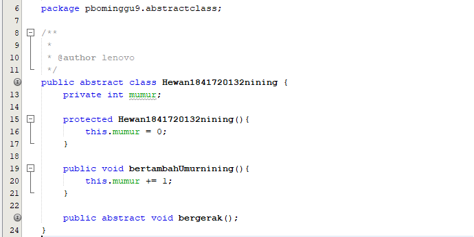 

2. Screenshot kode program class Kucing1841720132nining.

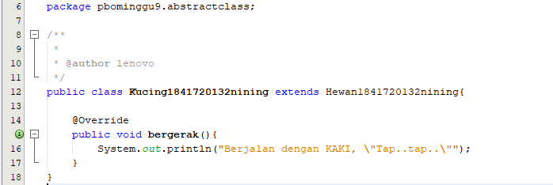 

3. Screenshot kode program class Ikan1841720132nining

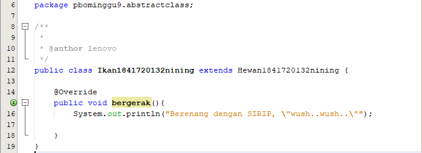 

4. Screenshot kode program class Orang1841720132nining.

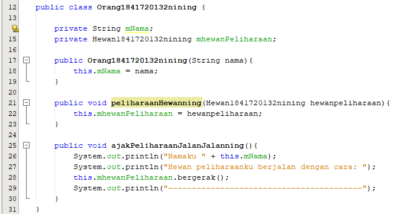 

4. Screenshot kode program class Program1841720132nining beserta outputnya.

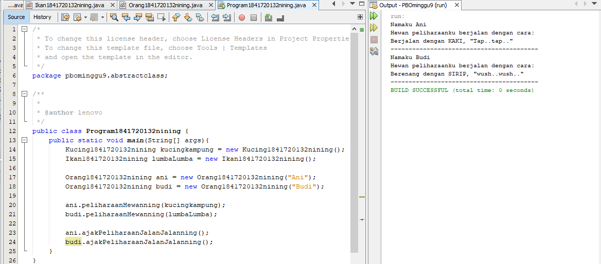 

link kode program : [Hewan1841720132nining.java](../../src/9_Abstract_class_dan_Interface/Hewan1841720132nining.java)

link kode program : [Kucing1841720132nining.java](../../src/9_Abstract_class_dan_Interface/Kucing1841720132nining.java)

link kode program : [Ikan1841720132nining.java](../../src/9_Abstract_class_dan_Interface/Ikan1841720132nining.java)

link kode program : [Orang1841720132nining.java](../../src/9_Abstract_class_dan_Interface/Orang1841720132nining.java)

link kode program : [Program1841720132nining.java](../../src/9_Abstract_class_dan_Interface/Program1841720132nining.java)

## Pertanyaan

Bolehkah apabila sebuah class yang meng-extend suatu abstract class tidak mengimplementasikan method abstract yang ada di class induknya? Buktikan! 

Jawab:  Tidak boleh, karena class turunannya harus meng-override method abstract dari class parent-nya. Jika tidakm akan terjadi error. 

➢ Contohnya jika pada class Kucing method bergerak dihapus, akan muncul pesan error untuk menambahkan method yang sama dengan abstract method class Hewan. 

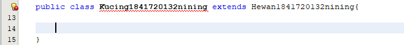 

### Percobaan 2 : Interface

1. Screenshot kode program class Interface ICumlaude1841720132nining.

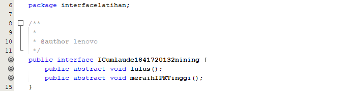 

2. Screenshot kode program class Mahasiswa1841720132nining.

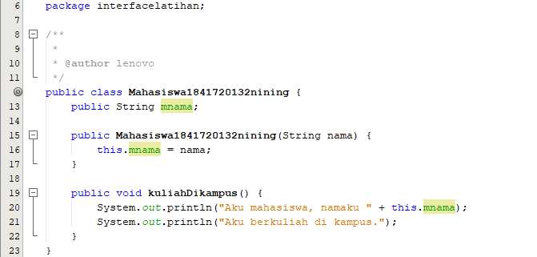 

3. Screenshot kode program class Sarjana1841720132nining

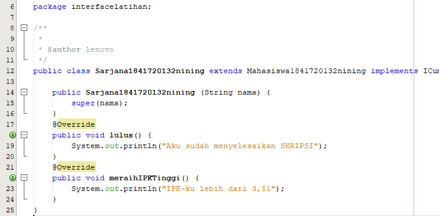 

4. Screenshot kode program class PascaSarjana1841720132nining.

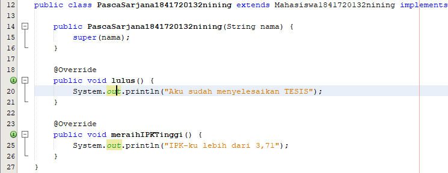 

4. Screenshot kode program class Rektor1841720132nining.

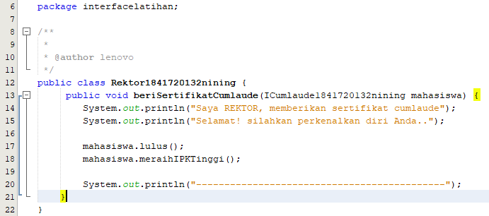 

5. Screenshot kode program class Program1841720132nining beserta outputnya.

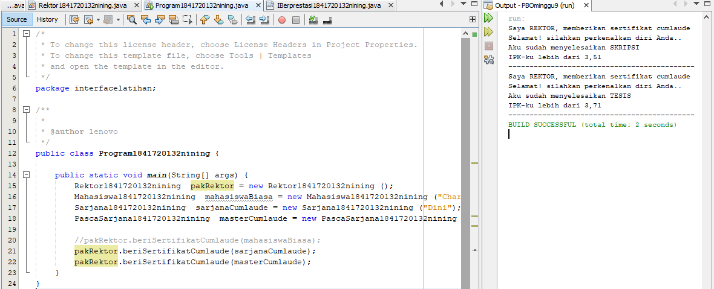 

link kode program : [Icumlaude1841720132nining.java](../../src/9_Abstract_class_dan_Interface/ICumlaude1841720132nining.java)

link kode program : [Mahasiswa1841720132nining.java](../../src/9_Abstract_class_dan_Interface/Mahasiswa1841720132nining.java)

link kode program : [Sarjana1841720132nining.java](../../src/9_Abstract_class_dan_Interface/Sarjana1841720132nining.java)

link kode program : [PascaSarjana1841720132nining.java](../../src/9_Abstract_class_dan_Interface/PascaSarjana1841720132nining.java)

link kode program : [Rektor1841720132nining.java](../../src/9_Abstract_class_dan_Interface/PascaSarjana1841720132nining.java)

link kode program : [Program1841720132nining.java](../../src/9_Abstract_class_dan_Interface/ProgramInterface1841720132nining.java)

## Pertanyaan

a. Mengapa pada langkah nomor 9 terjadi error? Jelaskan!

Jawab: Terjadi error karena objek pakRektor memanggil Mahasiswa. Sedangkan class Mahasiwa itu sendiri tidak ter-implements dengan Interface cumlaude. Dan pada class Rektor membutuhkan Interface cumlaude.

b. Dapatkah method kuliahDikampus() dipanggil dari objek sarjanaCumlaude di class Program? Mengapa demikian?

Jawab: Bisa, karena pada class Sarjana sudah di instansiasi menjadi objek sarjanaCumlaude di class Program. Dan class Sarjana sudah ter-extends dengan class Mahasiswa.

c. Dapatkah method kuliahDikampus() dipanggil dari parameter mahasiswa dimethod beriSertifikatCumlaude() pada class Rektor? Mengapa demikian?

Jawab: Tidak bisa, karena pada object pakRektor memanggil method
beriSertifikatCumlaude() untuk membuat inputan sebuah objek yang sudah
terinstansiasi. Bukan untuk memanggil method.

d. Modifikasilah method beriSerifikatCumlaude() pada class Rektor agar hasil eksekusi class Program menjadi seperti berikut:

Jawab:
- Class Sarjana

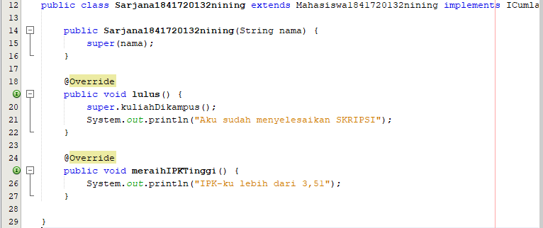 

- Class PascaSarjana

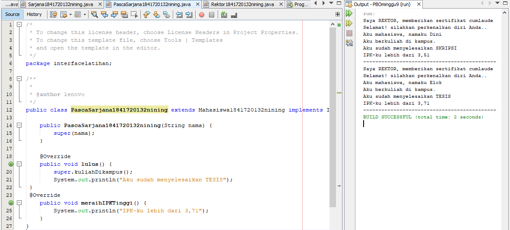 

### Percobaan 3 : Multiple Interfaces Implementation 

1. Screenshot kode program class Interface IBerprestasi1841720132nining.

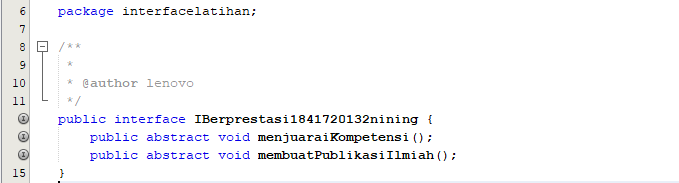 

2. Screenshot kode program class Sarjana1841720132nining.

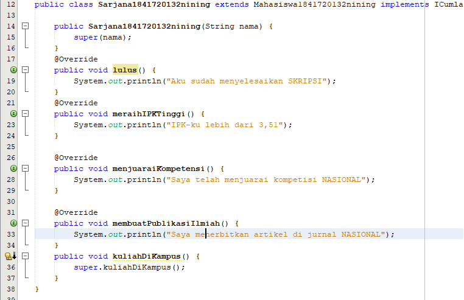 

3. Screenshot kode program class PascaSarjana1841720132nining

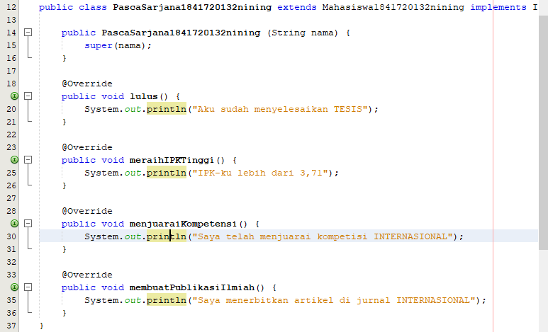 

4. Screenshot kode program class Rektor1841720132nining.

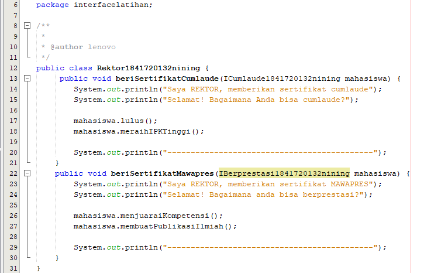 

5. Screenshot kode program class Program1841720132nining beserta outputnya.

 

link kode program : [IBerprestasi1841720132nining.java](../../src/9_Abstract_class_dan_Interface/ICumlaude1841720132nining.java)

link kode program : [Mahasiswa1841720132nining.java](../../src/9_Abstract_class_dan_Interface/Mahasiswa1841720132nining.java)

link kode program : [Sarjana1841720132nining.java](../../src/9_Abstract_class_dan_Interface/Sarjana1841720132nining.java)

link kode program : [PascaSarjana1841720132nining.java](../../src/9_Abstract_class_dan_Interface/PascaSarjana1841720132nining.java)

link kode program : [Rektor1841720132nining.java](../../src/9_Abstract_class_dan_Interface/PascaSarjana1841720132nining.java)

link kode program : [Program1841720132nining.java](../../src/9_Abstract_class_dan_Interface/ProgramInterface1841720132nining.java)

## Pertanyaan

Apabila Sarjana Berprestasi harus menjuarai kompetisi NASIONAL dan menerbitkan artikel di jurnal NASIONAL, maka modifikasilah class-class yang terkait pada aplikasi Anda agar di class Program objek pakRektor dapat memberikan sertifikat mawapres pada objek sarjanaCumlaude. 

Jawab: 

- Class Sarjana 

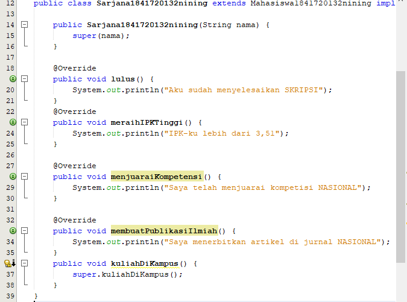 

- Class PascaSarjana

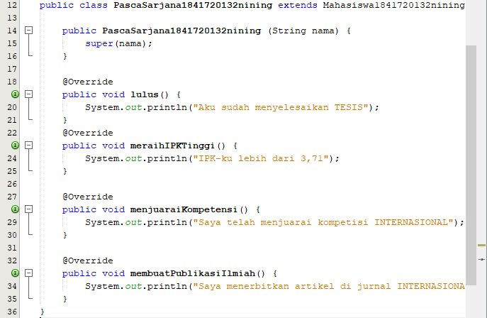

-Class Rektor 

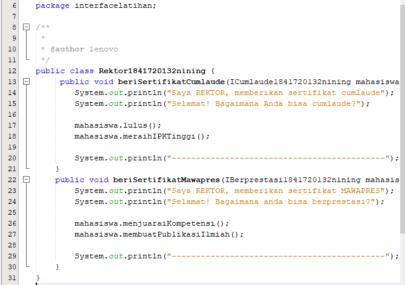

-Output Main Programnya
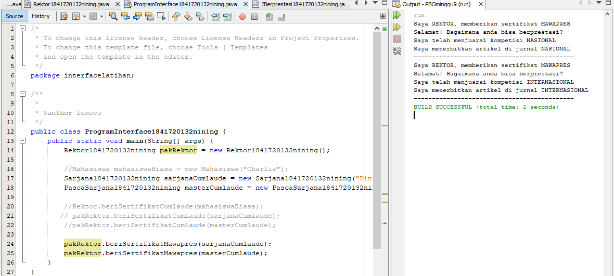 

## Kesimpulan

Kesimpulan yang didapat dari praktikum atau percobaan yang telah dilakukan adalah Mengetahui maksud dan tujuan dari penggunaan Abstract Class, Mengetahui maksud dan tujuan penggunaan Interface, Mengetahui langkah-langkah Abstract Class dan Interface di dalam pembuatan program.  

## Pernyataan Diri

Saya menyatakan isi tugas, kode program, dan laporan praktikum ini dibuat oleh saya sendiri. Saya tidak melakukan plagiasi, kecurangan, menyalin/menggandakan milik orang lain.

Jika saya melakukan plagiasi, kecurangan, atau melanggar hak kekayaan intelektual, saya siap untuk mendapat sanksi atau hukuman sesuai peraturan perundang-undangan yang berlaku.

Ttd,

DIMAHYANTI DWI LESTARININGSIH